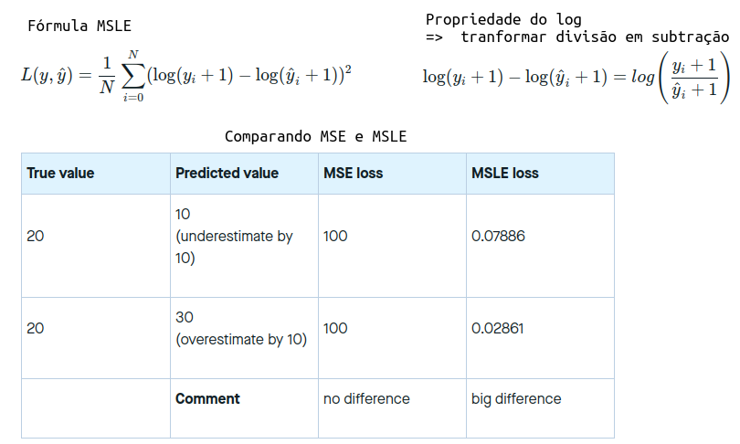
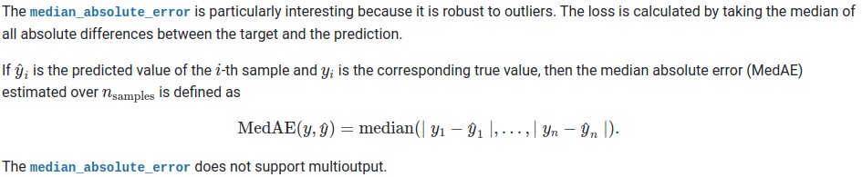
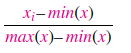
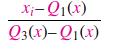
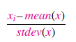
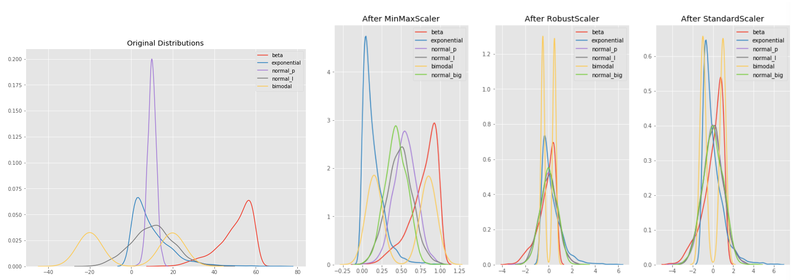
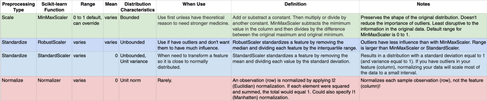

## Índex

## Links

+ [https://br.bitdegree.org/tutoriais/data-science/#Dicas_gerais_e_resumo](https://br.bitdegree.org/tutoriais/data-science/#Dicas_gerais_e_resumo)

## Glossário

Alguns termos preferi manter em inglês

+ dataset: o conjunto de dados
+ rows: linhas, no caso os registro da dataset

---
---
---

## Random Questions 

### Overfitting, Underfitting e Generalization, Bias e Variância?


**Bias**

+ **High Bias:** Alto Baias é quando as previsões do seu modelo estão longe dos valores reais. 
+ **Low Bias**: Baixo baias é quando as previsões do seu modelo estão muito próximas dos valores reais. 

**Variance**

+ **Low Variance** Baixa variação: quando você executa seu modelo várias vezes, as diferentes previsões de seus pontos de observação não variam muito. 
+ **High Variance** Alta Variância: quando você executa seu modelo várias vezes, as diferentes previsões de seus pontos de observação variam muito.

Busca-se baixo baias e variância.

### Qual é a diferença entre o aprendizado ‘supervisionado’ e ‘não supervisionado’?

Durante o aprendizado supervisionado, você infere uma função de uma parte rotulada de dados projetada para treinamento. Basicamente, a máquina aprenderia com os exemplos objetivos e concretos que você fornece.

Aprendizado não supervisionado refere-se a um método de treinamento de máquina que não usa respostas rotuladas – a máquina aprende por descrições dos dados de entrada.

### Qual a diferença entre Classificação e Regressão?

Os dois são atividades que podem ser realizadas por modelos de ML para predição.

A principal diferença é no valor de saída
+ Na classificação o valor é discreto (0 ou 1, ou [0,1,2,3..] ...)
  - Em classificação, o objetivo é classificar uma row em determinada categoria.
    + Exemplo: Dado uma row com características de uma flor, classificar que tipo de planta é ela (Iris)
+ Na regressão é contínuo (1,88; R$ 6.880,99 ...)
  - Em regressão, o objetivo é obter um valor numérico
    + Exemplo: Dado uma row de características de uma casa, predizer o valor dela  

### Qual a diferença entre covariância e correlação?

Correlação é a forma padronizada de covariância.

Covariâncias são difíceis de comparar. Por exemplo: se calcularmos as covariâncias de salário ($) e idade (anos), teremos diferentes covariâncias que não podem ser comparadas por causa de escalas desiguais.

Para combater essa situação, calculamos a correlação para obter um valor entre -1 e 1, independentemente da respectiva escala.
 
### É possível capturar a correlação entre variável contínua e variável categórica? Se sim, como?

Sim, podemos usar a técnica ANCOVA (análise de covariância) para capturar a associação entre variáveis contínuas e categóricas.

O acrônimo ANCOVA vem de “ANalysis of COVAriance”. Na realidade, a ANCOVA combina dois tipos de estratégias: Análise de Variância (ANOVA) e Análise de Regressão.

A análise de covariância permite aumentar a precisão dos experimentos e eliminar os efeitos de variáveis ​​que nada têm a ver com o tratamento , mas que, no entanto, estão influenciando os resultados.

Além disso, permite obter mais informações sobre a natureza dos tratamentos que estamos aplicando em nossa pesquisa. Em resumo, nos ajuda a ajustar nossos resultados para torná-los mais confiáveis.

https://pt.slideshare.net/UbirajaraFernandes/ancova-anlise-de-covarincia-ecologia-quantitativa-ubirajara-l-fernandes

https://maestrovirtuale.com/analise-de-covariancia-ancova-o-que-e-e-como-e-usado-em-estatistica/

---
---
---

## Regressão e Regularização

### O que é regressão? 

**Que modelos você pode usar para resolver problemas de regressão**

A regressão faz parte da área  de aprendizagem supervisionado de ML. Os modelos de regressão investigam a relação entre uma variável (s) dependente (*target*) independente (s) (*features*).

Exemplos

+ **Regressão linear** estabelece uma relação linear entre alvo e preditor (es). Ele prevê um valor numérico e tem o formato de uma linha **reta**.
+ **Regressão polinomial** tem uma equação de regressão com o poder da variável independente maior que 1. É uma **curva** que se encaixa nos pontos de dados.
+ **Regressão de Ridge** ajuda quando preditores são altamente correlacionados (problema de multicolinearidade). Ele penaliza os quadrados dos coeficientes de regressão, mas não permite que os coeficientes atinjam zeros (usa a regularização L2).
+ **Regressão do lasso** penaliza os valores absolutos dos coeficientes de regressão e permite que alguns deles alcancem o zero absoluto (permitindo a seleção de recursos). Usa regularização L1.
+ **Regressão Elastic-Net**: Usa as regularização L1 e L2.

### Quais métricas para avaliar modelos de regressão?


**Mean Squared Error(MSE) | Erro quadrático médio (EQM)**
+ Média da Somatória da diferença entre valor esperado (y) e valor previsto (ŷ) elevado ao quadrado
+ O MSE eleva o quadrado por duas razões:
  1. Erro acima do valor real ou abaixo vão ficar positivos (pois eleva ao quadrado.
  2. Os módulos dos erros maiores vão gerar maior penalidade, assim tende a ser mais impactado por outliers.
+ Tanto MSE quanto RMSE são muito impactados pela presença de outliers no Y. 
  - Então, se com essa métrica parecer ruim, observe se há ou não outliers pois eles podem está atrapalhando a sua métrica
**Root Mean Squared Error(RMSE) | Raiz do Erro Quadrático Médio (REQM**
+ Raiz da MSE, dessa forma volta a dimensão anterior dos erros antes de serem elevados ao quadrado


**(R)MSLE - (Root) Mean Squared Logarithmic Error - Raiz Quadrada do Erro Médio Logarítmico Quadrado**
+ É o MSE mas aplicando um Log
+ Ele acaba sendo uma aproximação do MSE para um **Erro percentual**
+ Matematicamente ele é mais fácil de minimizar
+ O MSE se importa com a diferença "absoluta", enquanto que o MSLE se importa com a diferença "relativa" por calcular o erro como uma *diferença percentual* entre o valor real (y) e o previsto (ŷ)
+ [link + msle](https://peltarion.com/knowledge-center/documentation/modeling-view/build-an-ai-model/loss-functions/mean-squared-logarithmic-error-(msle))
+ Costuma ser usado em vendas, exemplo: se espera vender 1000 e vende 1001 o impacto é menor pois só o fato de conseguir prever 1000 já é um grande ganho. Se usa-semos MSE o impacto entre y = 2 ŷ = 3 e seria o mesmo que y = 1000 e ŷ = 10001, que para uma venda, não é impactante assim.
+ **Comparando a questão de OutLiers entre MSE e MSLE**
  - O MSLE é sensível a outliers, bem menos que MSE porque há diferença que ele faz é relativa



**Mean Absolute Error(MAE) | Erro Absoluto Médio (EAM)**
+ Somatório da diferença entre o valor esperado (y) e o valor previsto (ŷ) dividido pela quantidade de previsões
+ Não é sensitivo a outliers, por isso, é usada para quando não se quer que os outliers tenham impacto na avaliação
+ Por isso você usa quando não tem outliers em geral, quando são extremamente raros
**Observação: MAE e MSE**
+ MSE e RMSE penalizam outliers e o MAE não
+ Então, se ao analisar seus dataset, os outliers existirem mas forem realmente parte dos seus dados, então, é recomendável usar MSE. 
+ Agora, se puder retirar os outliers, então é melhor o MAE


**MedAE - Median Absolute Error - Erro Mediano Absoluto**
+ As vezes também chamado de MAD
+ Fórmula: É a mediana da Serie dos módulos dos erros absolutos para cada predição
  - 1. Forma uma lista dos erros absolutos; 2. Aplica módulo (todos ficam positivos); 3. busca a mediana
+ Quanto menor, melhor
- Esse erro é raro de ver sendo usado, mas o foi no site de preço de casas na [Zillow](https://www.zillow.com/research/putting-accuracy-in-context-3255/)
+ MedAE é uma medida robusta , similar ao MAE por ignorar muito outliers, pois, se o erro nos outliers forem muito grandes, eles vão para a cabeça (head) ou calda (tails) da lista e assim só vai mover o index da mediana uma casa pra frente/trás da listagem de erros absolutos.

Lembrando: Mediana é o valor que fica no meio caso você ordenar tudo em forma ascendente um conjunto de dados.

Exemplo de como funciona
````python
import numpy as np
from sklearn.metrics import median_absolute_error

y_true = np.asarray([3, -0.5, 2, 7, 6])
y_pred = np.asarray([2.5, 0.0, 2, 8, 9])

print(np.sort(np.absolute(y_true - y_pred)))
# [0.  0.5 0.5 1.  3. ] Ordenando os erros em valores absolutos, o valor do meio é a MedAE: 0.5

median_error_manual = np.median(np.absolute(y_true - y_pred)) # calculo manual
print("manual", median_error_manual, "| sklearn", median_absolute_error(y_true, y_pred))
# manual 0.5 | sklearn 0.5
````



**MAPE - Mean Absolute Percentage Error - Erro Médio Percentual Absoluto**
+ Erro mais fácil de ser explicado, fica entre [0,1], quanto menor, melhor
+ É a média das porcentagens de erro
+ No exemplo abaixo temos se o  de MAPE é 0.42, quer dizer que: **O modelo erra 42% em média** em mas não se sabe se é acima do valor ou abaixo do valor real.


**R² or Coefficient of Determination | **Coeficiente de Determinação** $ R^2 $. **
+ [Porque o R² é inútil](https://data.library.virginia.edu/is-r-squared-useless/)
+ Basicamente, este coeficiente R² indica quanto o modelo foi capaz de explicar os dados coletados. O R² varia entre 0 e 1, indicando, em percentagem, o quanto o modelo consegue explicar os valores observados. Quanto maior o R², mais explicativo é o modelo, melhor ele se ajusta à amostra.
+ Por exemplo, se o R² de um modelo é 0,8234, isto significa que 82,34% da variável dependente consegue ser explicada pelos regressores presentes no modelo.
+ O R² deve ser usado com precaução, pois é sempre possível torná-lo maior pela adição de um número suficiente de termos ao modelo. Assim, se, por exemplo, não há dados repetidos (mais do que um valor `y` para um mesmo `x` ) um polinômio de grau `n - 1` dará um ajuste perfeito R² = 1 para n  dados. Quando há valores repetidos, o R² não será nunca igual a 1, pois o modelo não poderá explicar a variabilidade devido ao erro puro.
r. 

### O que é Regularização?

Técnica para tratar do problema de overfitting (quando o modelo se adapta demais aos dados de treinamento) ou de underfitting (quando não consegue se ajustar aos dados).


A regularização coloca mais informação para dar penalidade aos dados que trariam a condição de overfitting/underfitting.

Ele ajuda a reduzir a complexidade do modelo e assim fazer melhores previsões.

É aconselhado em que tem: poucas features para um dataSet muito grande ou ao contrário, quando há muitas features para poucos dados.

### Que tipo de técnicas de regularização são aplicáveis aos modelos lineares?

Regularização L1 (regularização Lasso) - Adiciona a soma dos valores absolutos dos coeficientes à função de custo.
Regularização L2 (regularização Ridge) - Adiciona a soma dos quadrados dos coeficientes à função de custo.

Há outro que são: AIC/BIC, Ridge, Lasso, Basis pursuit denoising, Rudin–Osher–Fatemi model (TV), Potts model, RLAD, Dantzig Selector, SLOPE

### Podemos usar a regularização L1 para a seleção de features?

Sim, porque a natureza da regularização L1 (Lasso) levará a coeficientes com pouco valor de importância à zero, podendo a sim ser eliminado do modelo.

Exemplo de Lasso
https://towardsdatascience.com/feature-selection-using-regularisation-a3678b71e499
````python
sel_ = SelectFromModel(LogisticRegression(C=1, penalty='l1'))
sel_.fit(scaler.transform(X_train.fillna(0)), y_train)
sel_.get_support()

# sel_.get_support(): Mostrará uma matriz de True/False, onde False serão as variáveis que foram levadas a Zero

# A seguir, selecionamos as colunas com True
selected_feat = X_train.columns[(sel_.get_support())]
print('total features: {}'.format((X_train.shape[1])))
print('selected features: {}'.format(len(selected_feat)))
print('features with coefficients shrank to zero: {}'.format(
      np.sum(sel_.estimator_.coef_ == 0)))
````

### Quando a regressão de Ridge é favorável em relação à regressão de Lasso?

Na presença de poucas variáveis com um dataset de tamanho médio / grande, use a regressão Lasso. 

Na presença de muitas variáveis com efeito de tamanho pequeno / médio, use regressão Ridge.

Conceitualmente, podemos dizer que a regressão de laço (L1) faz seleção de variáveis e encolhimento de parâmetros, enquanto a regressão de Ridge apenas encolhe e acaba incluindo todos os coeficientes do modelo. Na presença de variáveis correlacionadas, a regressão de Ridge pode ser a escolha preferida. Além disso, a regressão de Ridge funciona melhor em situações em que as estimativas menos quadradas têm maior variação. Portanto, depende do objetivo do nosso modelo.

### Quando a regularização se torna necessária no Machine Learning?

https://www.analyticsvidhya.com/blog/2016/09/40-interview-questions-asked-at-startups-in-machine-learning-data-science/

A regularização torna-se necessária quando o modelo começa a adequar demais (overfitting) ou não se adequar (underfitting). Essa técnica introduz um termo de custo para trazer mais recursos com a função objetivo. Portanto, ele tenta empurrar os coeficientes de muitas variáveis para zero e, portanto, reduzir o custo. Isso ajuda a reduzir a complexidade do modelo para que o modelo possa se tornar melhor na previsão (generalização).

---
---
---

## Avaliar Modelos

### Cross-Validattion

#### train_test_split ou holdout strategy

[sklearn - cross validation](https://scikit-learn.org/stable/modules/cross_validation.html)

<div style="text-align: center;">
		
</div>

Pros of the hold-out strategy: Fully independent data; only needs to be run once so has lower computational costs.

Cons of the hold-out strategy: Performance evaluation is subject to higher variance given the smaller size of the data.

**Problema holdout**

AO dividir em train/test, podemos cair no seguinte erro. Tunar os parâmetros para que obtenham o menor erro na base de teste. Perceba que a tunagem está diretamente ligada a essa base de test criando assim um overfiting (não consegue generalizar os dados).

Uma forma de evitar isso é fazer mais uma divisão da base, em uma de validação (`validation`).

Essa é testada somente no final. Todo o ajuste de erro é feito olhando para a de test e não para essa nova.


---

Porém vai acontecer o seguinte problema: dividir em 3 a base vai ter poucos dados para fazer o train/test/validate. 

Então, utilizamos cross-validation (apelido : CV) para fazer um treinamento otimizado com essa base menor, além de resolver outro problemas.

CV é uma técnica: em ter esse 3 datasets: train/test/final_validation e pode ser feito de várias formas

#### K-Fold CV

[link kdnuggets](https://www.kdnuggets.com/2017/08/dataiku-predictive-model-holdout-cross-validation.html)

K-fold validation evaluates the data across the entire training set, but it does so by dividing the training set into K folds – or subsections – (where K is a positive integer) and then training the model K times, each time leaving a different fold out of the training data and using it instead as a validation set. At the end, the performance metric (e.g. accuracy, ROC, etc. — choose the best one for your needs) is averaged across all K tests. Lastly, as before, once the best parameter combination has been found, the model is retrained on the full data.

Pros of the K-fold strategy: Prone to less variation because it uses the entire training set.

Cons of the K-fold strategy: Higher computational costs; the model needs to be trained K times at the validation step (plus one more at the test step).

<div style="text-align: center;">
		
</div>

<div style="text-align: center;">
		
</div>

### Como avaliar modelos de ML, para classificação e regressão?

Separa os dados em *train* e *test* de forma aleatória. Aplica o modelo na base de treinamento e avalia o seu modelo na base de teste.

Pode-se usar a técnica de *cross-validation* para garantir que essa divisão é adequada.

Os critérios de avaliação são válidos para determinadas atividade de ML

Classificação (y discreto)
+ Matriz de Confusão
+ Curva ROC, CAP e seus respectivos AUC
+ Acurácia, Precisão, Recall, Sensitividade, Especifidade
+ F1 Score

Regressão (y contínuo)
+ MAE, MSE, RMSE
+ R²

https://medium.com/@MohammedS/performance-metrics-for-classification-problems-in-machine-learning-part-i-b085d432082b

### Por que precisamos dividir nossos dados em três partes: treinamento, validação e teste?

O conjunto de treinamento é usado para ajustar o modelo, ou seja, para treinar o modelo com os dados.

O conjunto de validação é então usado para fornecer uma avaliação imparcial de um modelo enquanto o ajuste dos hiper parâmetros é feito. Isso melhora a generalização do modelo. 

Finalmente, um conjunto de dados de teste que o modelo nunca “viu” antes deve ser usado para a avaliação final do modelo. Isso permite uma avaliação imparcial do modelo. A avaliação nunca deve ser realizada com os mesmos dados usados para o treinamento. Caso contrário, o desempenho do modelo não seria representativo.

## O que é a Matriz de confusão e tudo o que ele engloba?

**Acurácia, Recall, Sensibilidade, F1 Score, Erro tipo 1 e 2**

Exemplo para uma classificação binária temos a seguinte matriz de confusão:

````
Matrix de Confusão    Nomenclatura das partes
 [ 65  3  ]               [ TP  FP ]
 [  3  29 ]               [ FN  TN ]
````

Onde:
+ TP (True Positive)  | Verdadeiro Positivo : A Classe é 1 e Previu 1 (O modelo acertou)
+ FP (False Positive) | Falso Positivo : A Classe é 1 e Previu 0 (O modelo errou) (erro tipo 1)
+ FN (False Negative) | Falso Negativo : A Classe é 0 e Previu 1 (O modelo errou) (erro tipo 2)
+ TN (True Negative)  | Verdadeiro Negativo : A Classe é 0 e Previu 0 (O modelo Acertou)


#### Erro Tipo 1 e tipo 2

**Erro tipo 1 / Taxa de Falso Positivo | False Positive Rate**
+ Quando afirma que pertence a uma classe quando na verdade não pertence
+ Erro Tipo 1 = FP/(FP + TN)

**Erro Tipo 2 / Taxa de Falso Negativo | False Negative Rate**
+ Quando afirma que não pertence a uma classe mas na verdade pertence
+ Erro Tipo 2 = FN/(FN + TN)

<div style="text-align: center;">
		
</div>

**Acurácia / Accuracy**

Métrica possível para avaliar o modelo de classificação para todas as classes.

Acurácia é a porcentagem total dos itens classificados **corretamente**

A pergunta que a acurácia responde é a seguinte: no geral, o quão frequente o classificador está correto?

<div style="text-align: center;">
	
</div>

Porém, em um dataset desbalanceado ela não será uma métrica tão boa.

**Observação: Nem sempre acurácia é uma boa métrica**

A Acurrácia não é uma boa métrica  quando há o dataSet está desbalanceado na quantidade de registros por classe. Por exemplo, na classificação binária com 95% da classe A e 5% da classe B, a precisão da previsão pode ser de 95%. Em datasets desbalanceados, precisamos escolher Precisão, Recall ou F1 Score, dependendo do problema que estamos tentando resolver.

- Definição de Acurácia: **Porcentagem de acerto do modelo**
- não use "oficialmente" (como métrica final a apresentar), apenas "preguiçosamente", há coisas muito melhores
- inadequada para dados desequilibrados, pode te enganar
- Exemplo: Imagine que você vai fazer um detector de spam. Na sua caixa de emails hoje, cerca de 98% dos seus emails não são spam. Por causa disso, se você simplesmente atribuir todos os emails como não-spam, você consegue uma acurácia monstruosa de 98% sem ser capaz de detectar um único spam. Isso acontece porque a quantidade de spam é extremamente baixa em realação a quantidade de não-spam, ou seja, seu dataset está desbalanceado.


#### Precisão, Precision

É a taxa da quantidade de itens positivos que foram devidamente classificados como positivos, ou seja, a taxa de acerto para classificar os itens de uma classe.

Precisão = TP / (TP + FP)
<div style="text-align: center;">

</div>

Trabalha com o Erro do tipo 1 (Falso Positivo): pega a vertical de TP com FP

TP FN
FP TN

Se digo que pertence a classe X, qual a certeza de está certo (qua bem acerto registro de classe X quando afirma que é da classe X)
+ Pega no pé de dizer que pertence a essa classe quano na verdade não pertence (erro tipo 1)

- Definição de Precisão: **Dos casos que eu previ como positivos (para uma classe) quantos realmente são?**
  - daqueles que classifiquei como corretos, quantos efetivamente eram?
  - Ex: se minha precisão for 98% para a classe 0, significa que, se vinher um registro classe 0, eu vou acertar muito
- Envio de cupons de desconto, custos diferentes para cada erro.
- Ex: se custa caro mandar a promoção, das pessoas que eu previ que iam comprar, quantas compraram?

#### Sensitividade, Recall, hit rate TPR (True Positive Rate)

Taxa de itens positivos a uma classe, que fora classificados como positivo pelo modelo do total de itens positivos.

Recall = TP / (TP + FN)

<div style="text-align: center;">
	
</div>

Trabalha com o **Erro Tipo 2 / Taxa de Falso Negativo | False Negative Rate**: 
pega a horizontal de TP com TN

TP FN
FP TN

Para os registros, quao bem diferencia se eles pertencem ou não a essa classe
+ Pega no pé no fato de dizer que não pertence quando na verdade pertence (erro tipo2)


- Definição de Recall: dos que eram realmente positivos (para uma classe) quantos eu detectei?
  - O recall é a frequência em que o seu classificador encontra os exemplos de uma classe: “quando realmente é da classe X, o quão frequente você classifica como X?”
  - Ex: se meu recall é de 98% para a classe 1, significa que,
- Chamado de taxa de detecção

#### Especificidade, Seletividade, TNR (True Negative Rate)

Taxa de itens previstos como não pertencente a classe do total desses itens negativos a essa classe.

Especificidade = TN/ ( TN + FP)
<div style="text-align: center;">

</div>

#### F1 Score

É a média harmônica entre precisão e recall. É uma medida melhor que o da acurácia quando as classe do dataSet estão desbalanceada pois ela vai refletir esse desbalanceamento.

F1 Score = 2 * Precisão * Recall / ( Precisão + Recall)

A média harmônica captura quando a quantidade de registros de uma classe é maior do que outra.

Exemplo:

<div style="text-align: center;">

</div>

#### Matrix de confusão em scikit-learnig

Exemplo: Para um dataSet com dados de um possível cliente para comprar ou não um produto temos

````python
from sklearn.metrics import confusion_matrix, accuracy_score, classification_report
precisão = accuracy_score(y_test, y_pred)
matriz = confusion_matrix(y_test, y_pred)
print("Accuracy\n", precisão, "\n")
print("Matrix de Confusão\n",matriz, "\n")
print("Matrix de Confusão Porcentagem\n",matriz/matriz.sum(), "\n")
print(classification_report(y_test,y_pred, target_names=['Not Purchased', 'Purchased']))
````
Gerando

````python
Accuracy
 0.94 

Confusion Matrix
 [[65  3]
 [ 3 29]] 

Confusion Matrix Percentage
 [[0.65 0.03]
 [0.03 0.29]] 

               precision    recall  f1-score   support

Not Purchased       0.96      0.96      0.96        68
    Purchased       0.91      0.91      0.91        32

     accuracy                           0.94       100

# Avaliando a classificação para cada classe:
+ Precision: Numero total de positivos do total dos classificados como positivos para uma classe
+ Recall: Numero de Positivos que foram devidamente identificados para uma classe
+ F1-Score: Media Harmonica entre precisão e recall
+ Support: Quantidade de amostras de uma classe

Avaliacao geral
+ Acurracia
````

### Kappa
+ Mede a concordância entre seu modelo e um modelo aleartório
+ Uma boa métrica que pouca gente conhece.
+ Costuma-se usar ele em multi-classes
+ Considera-se geralmente uma medida mais robusta do que o simples cálculo percentual de concordância, pois κ leva em consideração a possibilidade da ocorrência de um acaso
- [https://en.wikipedia.org/wiki/Cohen%27s_kappa](https://en.wikipedia.org/wiki/Cohen%27s_kappa)
+ Interpretando
  - Quanto maior o valor kappa, melhor
  - Ele pode ser negativo

````python
from sklearn.metrics import cohen_kappa_score

print("P = {}\nY = {}".format(p_multi_argmax, y_multi))
# P = [2 1 0 1 2 1 2 0 0 1]
# Y = [1 1 1 1 2 2 0 0 1 0]
cohen_kappa_score(y_multi, p_multi_argmax)
# 0.07692307692307687
````

### Log Loss or cross-entropy loss
+ **INDEPENDE DO Threshdold/pnto de corte**
- calculada para a probabilidade empírica do evento. Proporção que o evento ocorre na vida real
- Se o time A jogar contra o time B e tiver 40% de chances de ganhar, se jogarem 10 vezes, 4 vezes o time A vai ganhar.
- Se tivermos um modelo para prever isso, então, A log loss estará na mínima quando o modelo prever 0.4
- Ou seja, nosso modleo atingir 0.4 significa que está ótimo

**Se um evento no mundo real tem uma probabilidade limitada de acontecer, então nosso modelo também deverá ter essa mesma probabilidade na log loss se for perfeito**

Em um evento onde já se sabe a probaiblidade, já sabemos o limite que uma log loss pode ter, então, quão mais próximo dessa porcentagem melhor o nosos modelo.

A log loss estará minimizada (loss é o erro, erro mínimo == melhor modelo) quando o modelo prever exatamente  a prob de como o evento ocorre na vida real.

**É A MESMA COISA QUE BINARYCROSS ENTROPY = TEORIA DA INFORMAÇÃO**

**EM suma: A log loss é minimizada (modelo perfeito) quando a prob prevista é igual a probabildiade real**

---

Quando usar: A log loss é imporante quando a probabilidade para classificar algo tem que ser bem calibrada.

quanto menor a log losss, melhor

````python
from sklearn.metrics import log_loss

print("P = {}\nY = {}".format(p_binary, y_binary))

log_loss(y_binary, p_binary)
# P = [0.49460165 0.2280831  0.25547392 0.39632991 0.3773151  0.99657423
#  0.4081972  0.77189399 0.76053669 0.31000935]
# Y = [0 0 0 1 1 1 0 1 1 0]
# 0.456820673923256

# Previsão aleartória
p_random = np.ones(10) * 0.5
log_loss(y_binary, p_random)
# 0.6931471805599453

# Para uma previsão binária, seu modelo deve estár abaixo de 0.69
````

### Curva ROC e AUC ROC

A curva ROC representa uma relação entre sensibilidade (RECALL - ) e especificidade (NÃO PRECISÃO) e é comumente usada para medir o desempenho de classificadores binários.

**Interpretação**
+ E quando mais curvado e distante da diagonal , melhor é o desempenho do seu modelo.
+ Quanto mais próximo a curva do seu modelo da diagonal pior será o desempenho do modelo.
**Parâmetros**

+ TPR (true Positive Rate - Taxa de Verdadeiro Positivo) também chamado de **Sensibilidade** [0,1]

+ FPR (false Positve Rate - Taxa de Falso Positivo) que é calculado como `1 - ` **Especificidade** [0,1]


#### O que é ROC AUC, quando usar e como interpretar?

AUC (área debaixo da curva) ou AUC-ROC (Area Under the Receiver Operating Characteristics) é um valor numérico que resume a curva ROC.RC. Varia entre [0,1] quanto mais próximo de 1 melhor.

O interessante do AUC é que a métrica é invariante em escala, uma vez que trabalha com precisão das classificações ao invés de seus valores absolutos. Além disso, também mede a qualidade das previsões do modelo, independentemente do limiar de classificação.

AUC é o valor da integral da curva ROC. É um valor numérico entre \[0,1\].

É feito apartir do e TPR e FPR

Quanto maior o valor do AUC melhor será o modelo.

A seguir á alguns exemplos de gráficos ROC e valores AUC para entender a correlação entre eles

<div style="text-align: center;">

</div>
Exemplo de várias ROC

<div style="text-align: center;">

</div>

**outra interpretação**

- Interpretar ROC-AUC: **Qual é a chance de um exemplo positivo ter um score (previsão) maior do que um negativo?**
- bom quando garantir que positivos sejam rankeados acima dos negativos é mais importante do que prever a probabilidade real do evento
  + Exemplo do Spam: Diferente da log loss,eu não me importa com a probabilidade (a certeza do modelo) em classificar se é spam ou não (pois isso depende também no threshold). **Eu quero que o email que tenha mais cara de spam  mesmo seja devidamente classificado como spam**

+ qual é a chance de um exemplo positivo ter um score (previsão) maior do que um negativo?
+ bom quando garantir que positivos sejam rankeados acima dos negativos é mais importante do que prever a probabilidade real do evento

Experimento

+ Suponha que tenha duas caixas, uma com só exemplos positivos e outra com apenas exemplo negativas.
+ Eu quero saber: vou tirar dessas caixas um exemplo positivo e um exemplo de negativo ver a probabilidades do meu modelo e devolver pra caixa (é uma coisa de probabilidade sem reposição, possa pegar o mesmo mais de uma vez)
 - Olho a prob que meu modelo deu para esse exemplo positivo
 - Olho a prob que meu modelo deu para o exemplo negativo

Se a prob do positivo é maior que negativo, então, conto +1.

A porcentagem de veze que o positivo > negativo = AUC Score

AUC SCORE = **qual é a chance de um exemplo positivo ter uma prob maior que o do negativo**

É mais interessante quando eu quero saber que os positivos sejam mais identificáveis com certeza que os negativo (de certa forma um pouco relacionado com a Precision para os positivos).

````python
sum_over = 0
total = 100000

for i in range(total):

  caixa_de_positivos = p_binary[y_binary == 1] # caixa com só positivo
  caixa_de_negativos = p_binary[y_binary == 0] # caixa com só negativo

  positivo = np.random.choice(caixa_de_positivos, size=1, replace=False)
  negativo = np.random.choice(caixa_de_negativos, size=1, replace=False)

  if positivo > negativo:
    sum_over += 1

sum_over / total # AUC-ROC
````

### AUC da PRC - Area Under the Precision-Recall Curve
- É AVALIAR O ODELO INDEPNDENTE DO THRESHOLD
- acho mais estável e mais fácil de interpretar
- É uma média ponderada da curva de precision/recall
- **VOCÊ CONSEGUE AVALIAR INDEPENDENTE DO PONTO DE CORTE E ALÉM DISSO, VER O DESEMPENHO PARA VÁRIOS PONTOS DE CORTES DIFERENTES**
  + Assim, depois de usála, podemos escolher um ponto de corte bom

````python
from sklearn.metrics import average_precision_score
print("P = {}\nY = {}".format(p_binary, y_binary))

average_precision_score(y_binary, p_binary)
# P = [0.49460165 0.2280831  0.25547392 0.39632991 0.3773151  0.99657423
#  0.4081972  0.77189399 0.76053669 0.31000935]
# Y = [0 0 0 1 1 1 0 1 1 0]
# 0.8761904761904762
````


[tabela](https://scikit-learn.org/stable/auto_examples/model_selection/plot_precision_recall.html#sphx-glr-auto-examples-model-selection-plot-precision-recall-py)

[average_precision_score](https://scikit-learn.org/stable/modules/generated/sklearn.metrics.average_precision_score.html)

---
---
---

## Engenharia de Features

### Quais técnicas utilizadas para tratamento de variáveis categóricas?

Label Encoding
+ Usada quando há poucos valores únicos categóricos
+ Mapeia cada valor para um Número
+ Atenção: Use-o para quando o valor categórico poder ser convertido numa representação numérica:
  - Exemplo: Ruim, Bom, Ótimo [1,2,3]
  - Pois os valores numéricos terão impacto na aprendizagem, pois vai considerar o valor 1 mais fraco que 3 (no exemplo acima)

One Hot Encoding
+ Usada quando a variável categórica tem diversos valores
+ Para cada valor único, cria-se uma coluna a mais. É colocado 0 ou 1 para o caso de ter aquele atributo.
+ Exemplo Um atributo 'cidade' de um estado
  - Se existir X cidades, então são criadas mais X features, para cada row do dataSet, somente uma dessa X novas features terá o valor 1, as outras X-1 features terão valor 0.

### Por que usar one-hot-encoding ? ‍

Se simplesmente codificamos variáveis categóricas com Label-Encoding, elas se tornam ordinais, o que pode levar a consequências indesejáveis. Nesse caso, os modelos lineares tratam uma feature com o valor 4 como duas vezes melhor do que uma feature de valor 2. A codificação one-hot-encoding permite representar uma variável categórica em um espaço vetorial numérico, o que garante que os vetores de cada categoria tenham distâncias iguais entre si. 

A abordagem de one-hot-encoding não é adequada para todas as situações, porque, usando-a com variáveis categóricas de alta cardinalidade (por exemplo, identificação do cliente), encontraremos problemas por aumentar demais a dimensionalidade.

### DS-001 - Como selecionar as features mais importantes de um DataSet?

Remove as features que estão correlacionadas (pois mostram uma mesma tendência)

É possível fazer isso com:
+ Forward Selection, Backward Selection, Stepwise Selection
+ Random Forest, Xgboost 
+ Lasso Regressão

Avalia as variáveis e selecione as melhores delas.


### O que fazer com dados corrompidos ou faltantes?

https://analyticsindiamag.com/5-ways-handle-missing-values-machine-learning-datasets/

+ 1. Deletar as rows (se forem poucas estiverem corrompidas)
  - Prós:
    * A remoção completa dos dados com valores ausentes resulta em um modelo robusto e altamente preciso
    * A exclusão de uma linha ou coluna específica sem informações específicas é melhor, pois ela não tem um grande preso para predição
  - Contras:
    * Perda de informações e dados
    * Funciona mal se a porcentagem de valores ausentes for alta (digamos 30%), em comparação com o conjunto de dados inteiro

+ 2. Para variáveis numéricas substituir por média / mediana / moda
  - Prós:
    * Essa é uma abordagem melhor quando o tamanho dos dados é pequeno
    * Pode impedir a perda de dados, o que resulta na remoção de linhas e colunas
  - Contras:
    * Imputar as aproximações dos dados, variância e bias (o que é ruim)
    * Funciona mal em comparação com outro método de múltiplas imputações

+ 3. Atribuir a uma variável categórica valores exclusivos
  - Usar qualquer outro valor ou usar probabilidade para atribuir a cada valor único categórico, uma probabilidade e colocar nas rows
  - Prós:
    * Menos possibilidades com uma categoria extra, resultando em baixa variação após uma codificação quente - uma vez que é categórica
    * Nega a perda de dados adicionando uma categoria única
  - Contras:
    * Adiciona menos variação
    * Adiciona outro recurso ao modelo durante a codificação, o que pode resultar em baixo desempenho

+ 4. Prever valores faltantes
  - Pode-se usar regressão linear para predizer uma variável faltantes usando as outras que não tem valores faltantes
  - MELHORAR....
  - Prós:
    * Imputar a variável ausente é uma melhoria, desde que o viés da mesma seja menor que o viés da variável omitida
    * Gera estimativas imparciais dos parâmetros do modelo
  - Contras:
    * O viés também surge quando um conjunto de condicionamentos incompleto é usado para uma variável categórica
    * Considerado apenas como um *proxy* para os valores verdadeiros

+ 5. Usando algoritmos que suportam valores faltantes
  - Exemplo: KNN, Decision Tree e Random Forest
  - Prós:
    * Não requer a criação de um modelo preditivo para cada atributo com dados ausentes no conjunto de dados
    * A correlação dos dados é negligenciada
  - Contras:
    * É um processo muito demorado e pode ser crítico na mineração de dados onde grandes bancos de dados estão sendo extraídos
    * A escolha das funções de distância pode ser Euclidiana, Manhattan etc., o que não gera um resultado robusto

---
---
---

## Gradient boosting

### Como random forest é diferente de Gradient Boosting Machine (GBM)?

[https://www.analyticsvidhya.com/blog/2016/09/40-interview-questions-asked-at-startups-in-machine-learning-data-science/](https://www.analyticsvidhya.com/blog/2016/09/40-interview-questions-asked-at-startups-in-machine-learning-data-science/)

[https://www.analyticsvidhya.com/blog/2020/02/4-boosting-algorithms-machine-learning/](https://www.analyticsvidhya.com/blog/2020/02/4-boosting-algorithms-machine-learning/)

A diferença fundamental é que a Random Forest usa a técnica de ensacamento para fazer previsões. 

O GBM usa técnicas de reforço para fazer previsões.

Na técnica de ensacamento, um conjunto de dados é dividido em n amostras usando amostragem aleatória. Em seguida, usando um único algoritmo de aprendizado, um modelo é construído em todas as amostras. Mais tarde, as previsões resultantes são **combinadas** usando votação ou média. O ensacamento é feito em paralelo. Ao aumentar, após a primeira rodada de previsões, o algoritmo pesa previsões mal classificadas mais altas, de modo que elas possam ser corrigidas na rodada seguinte. Esse processo seqüencial de atribuir pesos mais altos a previsões classificadas incorretamente continua até que um critério de parada seja alcançado.

A Random Forest melhora a precisão do modelo reduzindo a variação (principalmente). As árvores cultivadas não são correlacionadas para maximizar a diminuição da variação. Por outro lado, o GBM melhora a precisão, reduzindo o viés e a variação de um modelo.

---
---
---

## Reajuste de Hyper Parâmetros (melhorar modelo)

### Que estratégias de ajuste de hyper parâmetros você conhece?

Dissecar
[https://towardsdatascience.com/hyperparameter-tuning-explained-d0ebb2ba1d35](https://towardsdatascience.com/hyperparameter-tuning-explained-d0ebb2ba1d35)
[https://towardsdatascience.com/8-advanced-python-tricks-used-by-seasoned-programmers-757804975802](https://towardsdatascience.com/8-advanced-python-tricks-used-by-seasoned-programmers-757804975802)

Existem várias estratégias para o hiper-ajuste, mas eu argumentaria que as três mais populares atualmente são as seguintes:

A Grid Search (pesquisa em grade)  é uma abordagem exaustiva, de modo que, para cada hiper-parâmetro, o usuário precisa fornecer manualmente uma lista de valores para o algoritmo testar. Depois que esses valores são selecionados, a Grid Search avalia o algoritmo usando cada combinação de hiper-parâmetros e retorna a combinação que fornece o resultado ideal (ou seja, MAE mais baixo). Como a grid search avalia o algoritmo fornecido usando todas as combinações, é fácil ver que isso pode ser bastante computacional e pode levar a resultados abaixo do ideal, uma vez que o usuário precisa especificar valores específicos para esses hiper-parâmetros, o que é propenso a erros e requer conhecimento de domínio.

...


---
---
---

## Feature Selection

[link mosntruoso](https://machinelearningmastery.com/feature-selection-with-real-and-categorical-data/)

+ Feature Selection: Select a subset of input features from the dataset.
  - Unsupervised: Do not use the target variable (e.g. remove redundant variables).
    *Correlation
  - Supervised: Use the target variable (e.g. remove irrelevant variables).
    * Wrapper: Search for well-performing subsets of features.
      + RFE
    * Filter: Select subsets of features based on their relationship with the target.
      + Statistical Methods
      + Feature Importance Methods
    * Intrinsic: Algorithms that perform automatic feature selection during training.
      + Decision Trees
+ Dimensionality Reduction: Project input data into a lower-dimensional feature space.


<div style="text-align: center;">


</div>

+ Numerical Variables
  - Integer Variables.
  - Floating Point Variables.
+ Categorical Variables.
  - Boolean Variables (dichotomous).
  - Ordinal Variables.
  - Nominal Variables.

Numerical Output: Regression predictive modeling problem.
Categorical Output: Classification predictive modeling problem.


How to Choose Feature Selection Methods For Machine Learning

### Numerical Input, Numerical Output

This is a regression predictive modeling problem with numerical input variables.

The most common techniques are to use a correlation coefficient, such as Pearson’s for a linear correlation, or rank-based methods for a nonlinear correlation.

- Pearson’s correlation coefficient (linear).
- Spearman’s rank coefficient (nonlinear)

### Numerical Input, Categorical Output

This is a classification predictive modeling problem with numerical input variables.

This might be the most common example of a classification problem,

Again, the most common techniques are correlation based, although in this case, they must take the categorical target into account.

- ANOVA correlation coefficient (linear).
- Kendall’s rank coefficient (nonlinear).

Kendall does assume that the categorical variable is ordinal.

### Categorical Input, Numerical Output

This is a regression predictive modeling problem with categorical input variables.

This is a strange example of a regression problem (e.g. you would not encounter it often).

Nevertheless, you can use the same “*Numerical Input, Categorical Output*” methods (described above), but in reverse.

### Categorical Input, Categorical Output

This is a classification predictive modeling problem with categorical input variables.

The most common correlation measure for categorical data is the [chi-squared test](https://machinelearningmastery.com/chi-squared-test-for-machine-learning/). You can also use mutual information (information gain) from the field of information theory.

- Chi-Squared test (contingency tables).
- Mutual Information.

In fact, mutual information is a powerful method that may prove useful for both categorical and numerical data, e.g. it is agnostic to the data types.

## Tips and Tricks for Feature Selection

This section provides some additional considerations when using filter-based feature selection.

### Correlation Statistics

The scikit-learn library provides an implementation of most of the useful statistical measures.

For example:

- Pearson’s Correlation Coefficient: [f_regression()](https://scikit-learn.org/stable/modules/generated/sklearn.feature_selection.f_regression.html)
- ANOVA: [f_classif()](https://scikit-learn.org/stable/modules/generated/sklearn.feature_selection.f_classif.html)
- Chi-Squared: [chi2()](https://scikit-learn.org/stable/modules/generated/sklearn.feature_selection.chi2.html)
- Mutual Information: [mutual_info_classif()](https://scikit-learn.org/stable/modules/generated/sklearn.feature_selection.mutual_info_classif.html) and [mutual_info_regression()](https://scikit-learn.org/stable/modules/generated/sklearn.feature_selection.mutual_info_regression.html)

Also, the SciPy library provides an implementation of many more statistics, such as Kendall’s tau ([kendalltau](https://docs.scipy.org/doc/scipy/reference/generated/scipy.stats.kendalltau.html)) and Spearman’s rank correlation ([spearmanr](https://docs.scipy.org/doc/scipy/reference/generated/scipy.stats.spearmanr.html)).

### Selection Method

The scikit-learn library also provides many different filtering methods once statistics have been calculated for each input variable with the target.

Two of the more popular methods include:

- Select the top k variables: [SelectKBest](https://scikit-learn.org/stable/modules/generated/sklearn.feature_selection.SelectKBest.html)
- Select the top percentile variables: [SelectPercentile](https://scikit-learn.org/stable/modules/generated/sklearn.feature_selection.SelectPercentile.html)

I often use *SelectKBest* myself.

### Transform Variables

Consider transforming the variables in order to access different statistical methods.

For example, you can transform a categorical variable to ordinal, even if it is not, and see if any interesting results come out.

You can also make a numerical variable discrete (e.g. bins); try categorical-based measures.

Some statistical measures assume properties of the variables, such as Pearson’s that assumes a Gaussian probability distribution to the observations and a linear relationship. You can transform the data to meet the expectations of the test and try the test regardless of the expectations and compare results.

### What Is the Best Method?

There is no best feature selection method.

Just like there is no best set of input variables or best machine learning algorithm. At least not universally.

Instead, you must discover what works best for your specific problem using careful systematic experimentation.

Try a range of different models fit on different subsets of features chosen via different statistical measures and discover what works best for your specific problem.

### Quando fazer

1. ** Você tem conhecimento de domínio? ** Se sim, construa um conjunto melhor de recursos ad hoc ””
2. ** Seus recursos são proporcionais? ** Se não, considere normalizá-los.
3. ** Você suspeita de interdependência de recursos? ** Em caso afirmativo, expanda seu conjunto de recursos construindo recursos conjuntivos ou produtos de recursos, tanto quanto os recursos do seu computador permitirem.
4. ** Você precisa remover as variáveis ​​de entrada (por exemplo, por razões de entendimento de custo, velocidade ou dados)? ** Se não, construa recursos disjuntivos ou somas ponderadas de recursos
5. ** Você precisa avaliar os recursos individualmente (por exemplo, para entender sua influência no sistema ou porque seu número é tão grande que você precisa fazer uma primeira filtragem)? ** Se sim, use um método de classificação variável; caso contrário, faça-o assim mesmo para obter resultados de linha de base.
6. ** Você precisa de um preditor? ** Se não, pare
7. ** Você suspeita que seus dados estejam "sujos" (possui alguns padrões de entrada sem sentido e / ou saídas ruidosas ou rótulos de classe incorretos)? ** Se sim, detecte os exemplos outlier usando as principais variáveis ​​de classificação obtidas na etapa 5 como representação; verifique e / ou descarte-os.
8. ** Você sabe o que tentar primeiro? ** Se não, use um preditor linear. Use um método de seleção direta com o método "probe" como critério de parada ou use o método incorporado de norma 0 para comparação, seguindo a classificação da etapa 5, construa uma sequência de preditores da mesma natureza usando subconjuntos crescentes de recursos. Você pode igualar ou melhorar o desempenho com um subconjunto menor? Se sim, tente um preditor não linear com esse subconjunto.
9. ** Você tem novas idéias, tempo, recursos computacionais e exemplos suficientes? ** Se sim, compare vários métodos de seleção de recursos, incluindo sua nova ideia, coeficientes de correlação, seleção reversa e métodos incorporados. Use preditores lineares e não lineares. Selecione a melhor abordagem com a seleção de modelos
10. ** Deseja uma solução estável (para melhorar o desempenho e / ou a compreensão)? ** Se sim, subamostra os dados e refaça a análise para várias "instruções de inicialização".

---
---
---

## Box Plot - Como interpretar

<div style="text-align: center;">


</div>

Trata de ver a extensão dos dados, o range junto com outra medidas.

A reta que separa a caixa é a mediana (o valor que ficaria no meio da distribuição se os dados forem ordenados). Isso quer dizer que, dado a mediadna, metade dos dados estao abaixo dela e a outra metade acima do valor da mediana

Os limite da caixa: Representam outras medianas. Ou seja, o valor que esta no meio da parte de baixo e da parte de cima, 

Assim, a caixa é o seguinte intervalo:
25%|50%|75% = Na caixa há 50% 
E as linhas os 25% menores e maiores valores

1 Quartil: da linha até a borda da caixa: range entre 0 e 25%

EXISTENCIA DE OUTILIERS:

É calculado dois valores para serem os limites:
max_da_corda = Q3 + 1,5 (Intervalo Q1<->Q3)
min_da_corda = Q1 - 1,5 (Intervalo Q1<->Q3)

Assim: eu garanto que 99% das amostra estarao dentro desse boxplot, que na distribuição normal é 6 sigma.

outliers: 
+ podem ser eventos raros que realmente acontece em seu experiemnto
  - MEsmo assim vc pode quere ele fora, já que são raros e podem influenciar seu modelo
+ Podem ser dados errados, e asism é melhor excluilos


---

## Dimensionar (Scale), padronizar (Standardize), or normalizar (Normalize)

link: https://towardsdatascience.com/scale-standardize-or-normalize-with-scikit-learn-6ccc7d176a02

MinMaxScaler, RobustScaler, StandardScaler, and Normalizer are scikit-learn methods to preprocess data for machine learning.

Escala (Scale) : Alterar intervalo de valores sem mudar a distribuição
+ Geralmente significa alterar o intervalo dos valores. O formato da distribuição não muda. Pense em como um modelo em escala de um edifício tem as mesmas proporções que o original, apenas menor. É por isso que dizemos que é re-desenhado em escala. O intervalo geralmente é definido de 0 a 1. Seria por exemplo, uma aplicação de regra de 3 para reduzir de um intervalo maior para menor

Padronizar (Standard) : Converte numa distribuição Normal
+ Geralmente significa alterar os valores para que o desvio padrão da distribuição da média seja igual a um. Produz algo muito próximo a uma distribuição normal. A escala é frequentemente implícita.

Normalizar (Normalize) : L1 e L2
+ Pode ser usado para significar uma das coisas acima (e mais!). Sugiro que você evite o termo normalizar, porque ele tem muitas definições e é propenso a criar confusão

**Scales**

**`MinMaxScaler`**

<div style="text-align: center;">

</div>

+ Preserva a forma da distribuição
+ Não reduz a importância dos outliers
+ Em geral a *range* fica entre \[0,1\]

O MinMaxScaler é um bom escalador para começar, a menos que você 
saiba que sua feature seja uma distribuição normal ou que os outliers tenham influência reduzida.

**`RobustScaler`**

<div style="text-align: center;">

</div>

transforma o vetor de recurso subtraindo a mediana e depois dividindo pelo intervalo interquartil (valor de 75% - valor de 25%).

Use RobustScaler se você deseja reduzir os efeitos de valores discrepantes, em relação ao MinMaxScaler.

**`StandardScaler`**

<div style="text-align: center;">

</div>

+ Para distribuições normais
+ O StandardScaler distorce as distâncias relativas entre os valores dos recursos, por isso geralmente é minha segunda opção nessa família de transformações.

**`Normalizer`**

<div style="text-align: center;">

</div>

+ Trabalha sobre as linhas, não as colunas
+ As normalizações L1 e L2 aplicam uma penalização as linhas
+ Transformam entre 1 e -1

**Resumo**


+ Use MinMaxScaler como padrão se você estiver transformando um recurso. Não distorce.
+ Você pode usar o RobustScaler se tiver discrepâncias e quiser reduzir a influência delas. No entanto, é melhor remover os valores discrepantes.
+ Use o StandardScaler se precisar de uma distribuição relativamente normal.
+ Use o Normalizador com moderação - normaliza as linhas de amostra, não as colunas de recursos. Pode usar a normalização l2 ou l1.

<div style="text-align: center;">

</div>

<div style="text-align: center;">

</div>


## Add

+ + Tratar outliers no y de regresssão: winsorizar
+ Se precizar de GPU para coisas extermamente seriesas, pode-se pensar em alugar a AWS que tem GPU pra essas coisas.
+ É sempre usar métricas de acordo com o negócio que está resolvendo: 
  - Em geral selecione uma primaria de acordo com o problema
   - Depois escolheas outra para ter mais ângulos de observação

   => Uma ideia interressante seria fazer um modelo focado em recall primiero e depois outro apra precision

==> recall x precision: se detectar positivos/negativos for mais importante que acertar positivos/negativos, então recall é m ais importante

==> Se não há ponto de corte e dados desbalanceados: AUC e PRC 

==> Como saber se ocorreu ovefiting: 
+ Em geral é quando score de testes está diferente do score de treinamento

+ Quando fazer feature selection:
  - Quando houver muitas features com um dataset pequeno
  - Usa-se o valor p (pearson) para encontrar a correlação entre x e y
  - As vezes, em vez de fazer feature selection, para regressão, pode ser necessário fazer Lasso//Ridge

  HUGE GLOSSARY

  https://ml-cheatsheet.readthedocs.io/en/latest/index.html
  https://peltarion.com/knowledge-center/documentation/glossary
  http://deeplearningbook.com.br/

  NEXT

  Lista de distribuiçôes possíveis


-------
-------
-------

Reler e colocar tudo aqui


https://towardsdatascience.com/your-ultimate-data-science-statistics-mathematics-cheat-sheet-d688a48ad3db

https://towardsdatascience.com/your-ultimate-data-manipulation-cleaning-cheat-sheet-731f3b14a0be

https://towardsdatascience.com/your-ultimate-data-mining-machine-learning-cheat-sheet-9fce3fa16

https://towardsdatascience.com/your-ultimate-python-visualization-cheat-sheet-663318470db


-------
-------
--------

## Hyper Params TUNING


LInk muito bom com descrição dos hyperparâmetros de alguns modelos

https://towardsdatascience.com/hyper-parameter-tuning-and-model-selection-like-a-movie-star-a884b8ee8d68


------
-------
---------

## Tips Python

https://medium.com/towards-artificial-intelligence/50-python-3-tips-tricks-e5dbe05212d7

Algumas devem ser boa

-----
------
-------

## CHosse ML MODEL

https://scikit-learn.org/stable/tutorial/machine_learning_map/

## Feature Selection

DISSECAR ESSE ARTIGO

https://medium.com/data-hackers/como-selecionar-as-melhores-features-para-seu-modelo-de-machine-learning-faf74e357913


-----
-----
-----
-------

### Why Use CV

The technique of cross validation (CV) is best explained by example using the most common method, K-Fold CV. When we approach a machine learning problem, we make sure to split our data into a training and a testing set. In K-Fold CV, we further split our training set into K number of subsets, called folds. We then iteratively fit the model K times, each time training the data on K-1 of the folds and evaluating on the Kth fold (called the validation data). As an example, consider fitting a model with K = 5. The first iteration we train on the first four folds and evaluate on the fifth. The second time we train on the first, second, third, and fifth fold and evaluate on the fourth. We repeat this procedure 3 more times, each time evaluating on a different fold. At the very end of training, we average the performance on each of the folds to come up with final validation metrics for the model.


