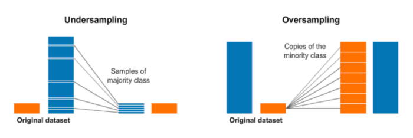

# Unbalanced

## DataSet Desbalanceado para CLassificaçâo

link: 

+ https://medium.com/data-hackers/como-lidar-com-dados-desbalanceados-em-problemas-de-classifica%C3%A7%C3%A3o-17c4d4357ef9

+ https://machinelearningmastery.com/combine-oversampling-and-undersampling-for-imbalanced-classification/

Imagine você ter a tareda de dado um email, verificar quais são ou são SPAM. O problema é possívelmente ocorreria é que para uma pessoa normal, a quantidade de emails SPAM é muito pequena, tipo 1%. Então para um dataset de 1000 registros de emails teriamos apenas 10 como sendo SPAM. Essa diferença, esse desbalanceamento muda a forma de avaliarmos os nossos modelos, pois poderiamos classificar 99% como não SPAM e teriamos um modelo de Acurracy de 99%, o que pareceria um modelo percefeito mas na verdade incapaz de fazer a tarefa. 

**Avaliar modelos para datasets desbalanceado**

Por isso, avaliar precision/recall/f1-score das classes se torna imporante. Um boa métrica de avaliaçâo para um modelo desbalanceado seria a média de f1-score das classes, pois assim saberiamos se o modelo consegue classificar bem mesmo para um subconjunto nao pequeno de dados (no caso a classe de SPAM).

**Como treinar sobe um dataset desbalanceado**

Como já deve ter percebido, essa difereça causa um grande impacto sobre no treinmento, já que havera poucos dados para o nosso modelo aprender o padrao de uma classe. ENtão a soluçâo é alterar: **Alterar o dataset na hora do treinamento da rede, para que o dataset se torne balanceado**.

No exmeplo do SPAM há duas abordagem para que o dataset fique balanceado

+ **UnderSampling**: Retirar rows de linhas Nao SPAM Para que tenha a mesma quantidade que NÃO SPAM.
+ **OverSampling**: Criar rows SPAM para que fique com mesma quantidade de rows que NÃO SPAM.

<div style="text-align: center;">

</div>

Para ambos há várias técnicas.

Para saber mais detalhes sobre as técnicas há a lib que trata essa questão de balacneamento e desbalanceamento

````
$ sudo pip install imbalanced-learn
# 
````

````

# check version number
import imblearn
print(imblearn.__version__)

````

### UnderSampling

+ Random UnderSampling: A técnica mais simples, tirar row aleartórias para que ambas as clases tenha mesma quantidade de row no dataset.

+ NeighbourhoodCleaningRule: Aplica o algoritmo dos vizinhos próximos e remove as observações que não se enquadram. A cada iteração é aumentado a quantidade de vizinhos próximos no modelo.

+ AllKNN: Foca em limpar os dados e não condensá-los.


### OverSampling 

+ Random Oversampling: Randomly duplicate examples in the minority class.

+ SMOTE: Primeiro passo é encontrar os vizinhos próximos para as classes em minoria para cada amostra das classificações. Em seguida, traça uma reta entre o ponto original e o vizinho para definir a localização da observação da observação genérica.

### ReSampling

Seria aplciar UnderSampling na clase que tem mais e overSampling na classe que tem menos.

Duas técnicas de under sampling (TomekLinks e nearest-neighbours) combinadas com SMOTE para obter uma amostra mais limpa e com as classificações bem balanceadas. Essa combinação resulta em dois modelos de over e under sampling chamadas SMOTETomek e SMOTEENN por exemplo.

### Como proceder

Pode-se buscar testas várias combinações de under e over sampling das mais diversas técnicas para buscar a que melhor der resultado.

Exemplo de instâncias de `imblearn` para fazer esse  *sampling*

link: https://machinelearningmastery.com/combine-oversampling-and-undersampling-for-imbalanced-classification/

[Paper Academico - A Study of the Behavior of Several Methods for Balancing Machine Learning Training Data](http://citeseerx.ist.psu.edu/viewdoc/download?doi=10.1.1.58.7757&rep=rep1&type=pdf)

>  Our results show that the
over-sampling methods in general, and Smote + Tomek and
Smote + ENN (two of the methods proposed in this work) in
particular for data sets with few positive (minority) examples, provided very good results in practice. Moreover, Random over-sampling, frequently considered an unprosperous
method provided competitive results with the more complex
methods. As a general recommendation, Smote + Tomek or
Smote + ENN might be applied to data sets with a small
number of positive instances, a condition that is likely to
lead to classification performance problems for imbalanced
data sets. For data sets with larger number of positive examples, the Random over-sampling method which is computationally less expensive than other methods would produce
meaningful results


````python
from imblearn.under_sampling import RandomUnderSampler, TomekLinks
from imblearn.over_sampling import RandomOverSampler, SMOTE
from imblearn.combine import SMOTEENN, SMOTETomek

# Exemplos de ReSmalping

from collections import Counter
print('Resampled dataset shape %s' % Counter(y_res))
# SHOW: Resampled dataset shape Counter({0: 900, 1: 881})

# Random OverSamlping + Random UnderSampling
over = RandomOverSampler(sampling_strategy=0.1)
under = RandomUnderSampler(sampling_strategy=0.5)

# SMOTE OverSamlping + Random UnderSampling
over = SMOTE(sampling_strategy=0.1)
under = RandomUnderSampler(sampling_strategy=0.5)

# SMOTE OverSamlping + Tomek UnderSampling
resample = SMOTETomek(tomek=TomekLinks(sampling_strategy='majority'))

# SMOTE OverSamlping + ENN UnderSampling
resample = SMOTEENN()


````
