<!--
Conceitos
Supervisioned Learning
Avaliaçâo de ML
Classificaçâo 
REgressão
Sleçâo de Features
Árvore de Decisão
Gradient Boosting
Parameter tunings
Redução de dimensionalidade

O índex deve ser bem elaborado, deixando cada coisa junta:
usar h3 e h4, mas nao h5 pois é pequeno demais

O que está separado aqui
+ Conceituais e Teóricas
+ Técnicas
+ Avaliar Modelos
+Engenhraia de Features
-->

## Índex

## Links
+ [https://br.bitdegree.org/tutoriais/data-science/#Dicas_gerais_e_resumo](https://br.bitdegree.org/tutoriais/data-science/#Dicas_gerais_e_resumo)

## Conceituais e Teóricas

### DS-001 - O que é Data Science?

Ciência de dados é a atividade de extrair informação a apartir de dados, estruturados (usando ml) ou não estruturados ( usando dl).

Data Science NÃO É IA, Estatística, ML (Machine Learning), Big Data, Power BI nem Algoritmos.

### DS-002 - O que é Big Data?

Big data significa ter enorme volume de dados. O termo em si significa isso mas pode engloba toda a parte de arquitetura de uma empresa para suportar ter esse dados (como o Hadoop).

### DS-003 - Qual é a diferença entre ‘data science’ e ‘big data’?

Big Data em si não traz valor algum sem a técnica de Data Science. Então, Big Data é um objeto de análise de Data Science.

### DS-004 - Qual é a diferença entre um ‘data scientist’ e um ‘data analyst’?

A DataScience busca retirar informações apartir de técnicas computacionais: para Classificação, Regressão e etc..

Data Analytics resolve problemas de negócios, utilizando mais a estatística para resolver as coisas.

### DS-005 - Quais são os recursos fundamentais que representam big data?

Agora que abordamos as definições, podemos passar para as perguntas mais específicas de uma entrevista sobre data science. Tenha em mente, porém, que você será obrigado a responder perguntas relacionadas a data scientist, data analyst e big data. A razão para isso acontecer é porque todas essas subcategorias estão interligadas entre si.

Existem cinco categorias que representam big data e são chamadas de ” 5 Vs “:

+ Valor;
+ Variedade;
+ Velocidade;
+ Veracidade;
+ Volume.

Todos esses termos correspondem ao Big Data de uma maneira ou de outra.

### DS-006 - Qual a diferença entre IA, ML e DL?

ML, DL e NN (Neural Networks) são subconjuntos da área de INteligência Artificial

IA < ML < DL 

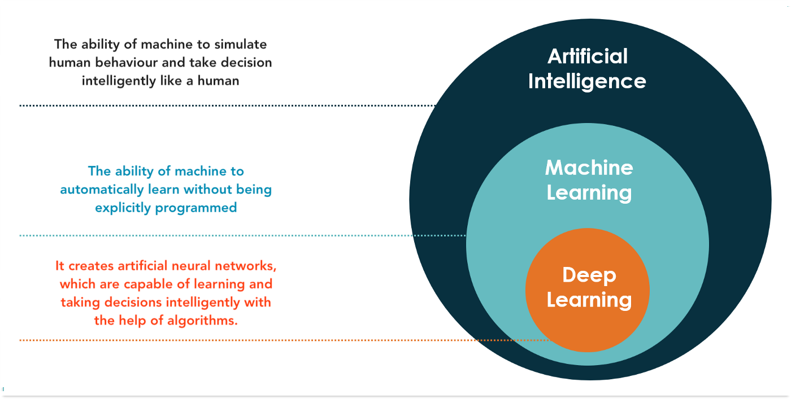

ML é uma área de IA que trata de algoritmos ou técnicas computacionais para máquinas/modelo/algoritmo aprender automaticamente com os dados.

DL é um conjunto de ML que trata das redes neurais com várias camadas e mais complexas.

---
---
---

## + Técnicas 

### DS-007 - O que é Overfitting, Underfitting e Generalization, Bias e Variância?


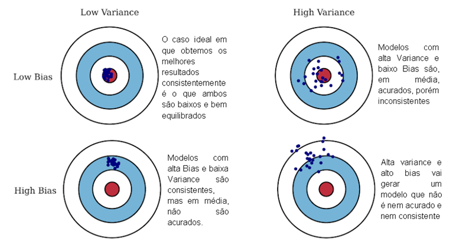

+ **High Variance:** Baixo erro em dados de treino e alto erro em dados de teste
+ **High Bias:** Alto erro em dados de treino e erro parecido em dados de teste
+ **High Bias and Variance**: Alto erro em dados de treino e erro maior em dados de teste
+ **Low Bias and Variance:** Baixo erro em dados de treino e baixo erro em dados de teste

**What is low/high bias/variance?**

These concepts are important to understand k-Fold Cross Validation:
Low Bias is when your model predictions are very close to the real values.
High Bias is when your model predictions are far from the real values.
Low Variance: when you run your model several times, the different predictions of your observation points
won’t vary much.
High Variance: when you run your model several times, the different predictions of your observation points
will vary a lot.


### DS-010 - Qual é a diferença entre o aprendizado ‘supervisionado’ e ‘não supervisionado’?

Embora essa não seja uma das perguntas mais comuns das entrevistas, e, tenha mais a ver com machine learning do que com qualquer outra coisa, ela ainda assim pertence ao data science, portanto vale a pena saber a resposta.

Durante o aprendizado supervisionado, você infere uma função de uma parte rotulada de dados projetada para treinamento. Basicamente, a máquina aprenderia com os exemplos objetivos e concretos que você fornece.

Aprendizado não supervisionado refere-se a um método de treinamento de máquina que não usa respostas rotuladas – a máquina aprende por descrições dos dados de entrada.

### DS-012 - Qual a diferença entre Classificação e Regressão?

Os dois são atividades que podem ser realizadas por modelos de ML para predição.

A principal diferença é no valor de saída
+ Na classificação o valor é discreto (0 ou 1, ou [0,1,2,3..] ...)
+ Na regressão é contínuo (1,88; R$ 6.880,99 ...)

Em classificação, o objetivo é classificar uma row em determinada categoria.
+ Exemplo: Dado uma row com características de uma flor, classificar que tipo de planta é ela (Iris)

Em regressão, o objetivo é obter um valor numérico
+ Exemplo: Dado uma row de características de uma casa, predizer o valor dela  


### DS-001 Qual a diferença entre covariância e correlação?

Correlação é a forma padronizada de covariância.

Covariâncias são difíceis de comparar. Por exemplo: se calcularmos as covariâncias de salário ($) e idade (anos), teremos diferentes
covariâncias que não podem ser comparadas por causa de escalas desiguais.

Para combater essa situação, calculamos a correlação para obter um valor
entre -1 e 1, independentemente da respectiva escala.
 

### DS-001 - É possível capturar a correlação entre variável contínua e variável categórica? Se sim, como?

Sim, podemos usar a técnica ANCOVA (análise de covariância) para capturar a associação entre variáveis contínuas e categóricas.

O acrônimo ANCOVA vem de “ANalysis of COVAriance”. Na realidade, a ANCOVA combina dois tipos de estratégias: Análise de Variância (ANOVA) e Análise de Regressão.

A análise de covariância permite aumentar a precisão dos experimentos e eliminar os efeitos de variáveis ​​que nada têm a ver com o tratamento , mas que, no entanto, estão influenciando os resultados.

Além disso, permite obter mais informações sobre a natureza dos tratamentos que estamos aplicando em nossa pesquisa. Em resumo, nos ajuda a ajustar nossos resultados para torná-los mais confiáveis.

https://pt.slideshare.net/UbirajaraFernandes/ancova-anlise-de-covarincia-ecologia-quantitativa-ubirajara-l-fernandes

https://maestrovirtuale.com/analise-de-covariancia-ancova-o-que-e-e-como-e-usado-em-estatistica/

---
---
---

## Regressão e Regularização

### O que é regressão? Que modelos você pode usar para resolver problemas de regressão

A regressão faz parte da área  de aprendizagem supervisionado de ML. Os modelos de regressão investigam a relação entre uma variável (s) dependente (*target*) independente (s) (*features*).

Exemplos

+ **Regressão linear** estabelece uma relação linear entre alvo e preditor (es). Ele prevê um valor numérico e tem o formato de uma linha **reta**.
+ **Regressão polinomial** tem uma equação de regressão com o poder da variável independente maior que 1. É uma **curva** que se encaixa nos pontos de dados.
+ **Regressão de Ridge** ajuda quando preditores são altamente correlacionados (problema de multicolinearidade). Ele penaliza os quadrados dos coeficientes de regressão, mas não permite que os coeficientes atinjam zeros (usa a regularização L2).
+ **Regressão do lasso** penaliza os valores absolutos dos coeficientes de regressão e permite que alguns deles alcancem o zero absoluto (permitindo a seleção de recursos). Usa regularização L1.
+ **Regressão Elastic-Net**: Usa as regularização L1 e L2.

### Quais métricas para avaliar modelos de regressão você conhece?

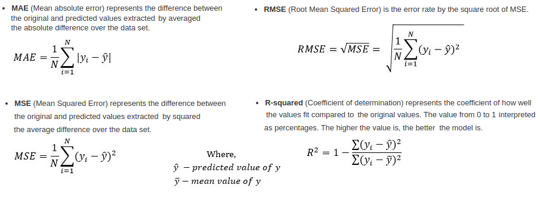

**Mean Squared Error(MSE) | Erro quadrático médio (EQM)**
+ Média da Somatória da diferença entre valor esperado (y) e valor previsto (ŷ) elevado ao quadrado

**Root Mean Squared Error(RMSE) | Raiz do Erro Quadrático Médio (REQM**
+ Raiz da MSE

**Mean Absolute Error(MAE) | Erro Absoluto Médio (EAM)**
+ Somatório da diferença entre o valor esperado (y) e o valor previsto (ŷ) dividido pela quantidade de previsões

**R² or Coefficient of Determination | **Coeficiente de Determinação** $ R^2 $. **
+ Basicamente, este coeficiente R² indica quanto o modelo foi capaz de explicar os dados coletados. O R² varia entre 0 e 1, indicando, em percentagem, o quanto o modelo consegue explicar os valores observados. Quanto maior o R², mais explicativo é o modelo, melhor ele se ajusta à amostra.
+ Por exemplo, se o R² de um modelo é 0,8234, isto significa que 82,34% da variável dependente consegue ser explicada pelos regressores presentes no modelo.
+ O R² deve ser usado com precaução, pois é sempre possível torná-lo maior pela adição de um número suficiente de termos ao modelo. Assim, se, por exemplo, não há dados repetidos (mais do que um valor `y` para um mesmo `x` ) um polinômio de grau `n - 1` dará um ajuste perfeito R² = 1 para n  dados. Quando há valores repetidos, o R² não será nunca igual a 1, pois o modelo não poderá explicar a variabilidade devido ao erro puro.
r. 

**Observação: MAE e MSE**
+ MSE e RMSE penalizam outliers e o MAE não
+ Então, se ao analisar seus dataset, os outliers existirem mas forem realmente parte dos seus dados, então, é recomendável usar MSE. 
+ Agora, se puder retirar os outliers, então é melhor o MAE

### O que é Regularização?

Técnica para tratar do problema de overfitting (quando o modelo se adapta demais aos dados de treinamento) ou de underfitting (quando não consegue se ajustar aos dados).


A regularização coloca mais informação para dar penalidade aos dados que trariam a condição de overfitting/underfitting.

Ele ajuda a reduzir a complexidade do modelo e assim fazer melhores previsões.

É aconselhado em que tem: poucas features para um dataSet muito grande ou ao contrário, quando há muitas features para poucos dados.

### Que tipo de técnicas de regularização são aplicáveis aos modelos lineares?

Regularização L1 (regularização Lasso) - Adiciona a soma dos valores absolutos dos coeficientes à função de custo.
Regularização L2 (regularização Ridge) - Adiciona a soma dos quadrados dos coeficientes à função de custo.

Há outro que são: AIC/BIC, Ridge, Lasso, Basis pursuit denoising, Rudin–Osher–Fatemi model (TV), Potts model, RLAD, Dantzig Selector,SLOPE

### Podemos usar a regularização L1 para a seleção de features?

Sim, porque a natureza da regularização L1 (Lasso) levará a coeficientes com pouco valor à zero

Exemplo de Lasso
https://towardsdatascience.com/feature-selection-using-regularisation-a3678b71e499
````python
sel_ = SelectFromModel(LogisticRegression(C=1, penalty='l1'))
sel_.fit(scaler.transform(X_train.fillna(0)), y_train)
sel_.get_support()

# sel_.get_support(): Mostrará uma matriz de True/False, onde False serão as variáveis que foram levadas a Zero

# A seguir, selecionamos as colunas com True
selected_feat = X_train.columns[(sel_.get_support())]
print('total features: {}'.format((X_train.shape[1])))
print('selected features: {}'.format(len(selected_feat)))
print('features with coefficients shrank to zero: {}'.format(
      np.sum(sel_.estimator_.coef_ == 0)))
````

### Quando a regressão de Ridge é favorável em relação à regressão de Lasso?

Na presença de poucas variáveis com um dataset de tamanho médio / grande, use a regressão Lasso. 

Na presença de muitas variáveis com efeito de tamanho pequeno / médio, use regressão Ridge.

Conceitualmente, podemos dizer que a regressão de laço (L1) faz seleção de variáveis e encolhimento de parâmetros, enquanto a regressão de Ridge apenas encolhe e acaba incluindo todos os coeficientes do modelo. Na presença de variáveis correlacionadas, a regressão de Ridge pode ser a escolha preferida. Além disso, a regressão de Ridge funciona melhor em situações em que as estimativas menos quadradas têm maior variação. Portanto, depende do objetivo do nosso modelo.

---
---
---

## Avaliar Modelos

### Como avaliar modelos de ML, para classificação e regressão?

Separa os dados em *train* e *test* de forma aleatória. Aplica o modelo na base de treinamento e avalia o seu modelo na base de teste.

Pode-se usar a técnica de *cross-validation* para garantir que essa divisão é adequada.

Os critérios de avaliação são válidos para determinadas atividade de ML

Classificação (y discreto)
+ Matriz de Confusão
+ Curva ROC, CAP e seus respectivos AUC
+ Acurácia, Precisão, Recall, Sensitividade, Especifidade
+ F1 Score

Regressão (y contínuo)
+ MAE, MSE, RMSE
+ R²

https://medium.com/@MohammedS/performance-metrics-for-classification-problems-in-machine-learning-part-i-b085d432082b

### Por que precisamos dividir nossos dados em três partes: treinamento, validação e teste?

O conjunto de treinamento é usado para ajustar o modelo, ou seja, para treinar o modelo com os dados.

O conjunto de validação é então usado para fornecer uma avaliação imparcial de um modelo enquanto o ajuste dos hiper parâmetros é feito. Isso melhora a generalização do modelo. 

Finalmente, um conjunto de dados de teste que o modelo nunca “viu” antes deve ser usado para a avaliação final do modelo. Isso permite uma avaliação imparcial do modelo. A avaliação nunca deve ser realizada com os mesmos dados usados para o treinamento. Caso contrário, o desempenho do modelo não seria representativo.


### How do we choose K in K-fold cross-validation? What’s your favorite K? 👶

There are two things to consider while deciding K: t
+ he number of models we get and the size of validation set. We do not want the number of models to be too less, like 2 or 3. At least 4 models give a less biased decision on the metrics. On the other hand, we would want the dataset to be at least 20-25% of the entire data. So that at least a ratio of 3:1 between training and validation set is maintained.
I tend to use 4 for small datasets and 5 for large ones as K.

## O que é a Matriz de confusão e tudo o que ele engloba?

**Acurácia, Recall, Sensibilidade, F1 Score, Erro tipo 1 e 2**

Exemplo para uma classificação binária temos a seguinte matriz de confusão:

````
Matrix de Confusão    Nomenclatura das partes
 [ 65  3  ]               [ TP  FP ]
 [  3  29 ]               [ FN  TN ]
````

Onde:
+ TP (True Positive)  | Verdadeiro Positivo : A Classe é 1 e Previu 1 (O modelo acertou)
+ FP (False Positive) | Falso Positivo : A Classe é 1 e Previu 0 (O modelo errou) (erro tipo 1)
+ FN (False Negative) | Falso Negativo : A Classe é 0 e Previu 1 (O modelo errou) (erro tipo 2)
+ TN (True Negative)  | Verdadeiro Negativo : A Classe é 0 e Previu 0 (O modelo Acertou)


#### Erro Tipo 1 e tipo 2

**Erro tipo 1 / Taxa de Falso Positivo | False Positive Rate**
+ Quando afirma que pertence a uma classe quando na verdade não pertence
+ Erro Tipo 1 = FP/(FP + TN)

**Erro Tipo 2 / Taxa de Falso Negativo | False Negative Rate**
+ Quando afirma que não pertence a uma classe mas na verdade pertence
+ Erro Tipo 2 = FN/(FN + TN)

<div style="text-align: center;">
	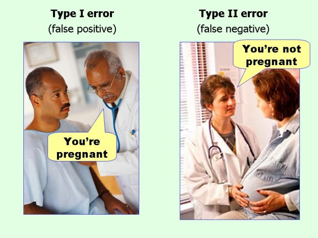	
</div>

**Acurácia / Accuracy**

Métrica possível para avaliar o modelo de classificação para todas as classes.

Acurácia é a porcentagem total dos itens classificados **corretamente**

<div style="text-align: center;">
	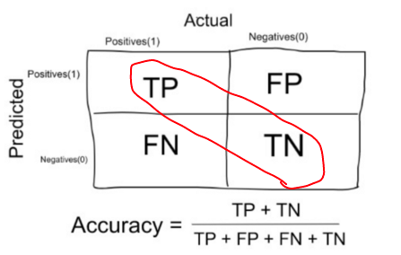
</div>

Porém, em um dataset desbalanceado ela não será uma métrica tão boa.

**Observação: Nem sempre acurácia é uma boa métrica**

A Acurrácia não é uma boa métrica  quando há o dataSet está desbalanceado na quantidade de registros por classe. Por exemplo, na classificação binária com 95% da classe A e 5% da classe B, a precisão da previsão pode ser de 95%. Em datasets desbalanceados, precisamos escolher Precisão, Recall ou F1 Score, dependendo do problema que estamos tentando resolver.


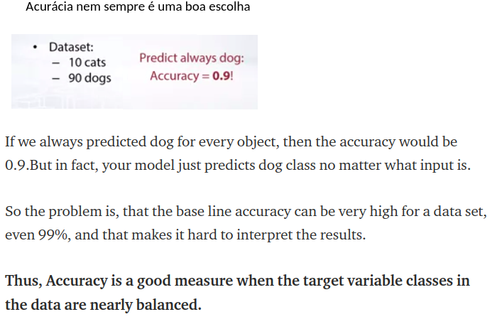

#### **Precisão, Precision**

É a taxa da quantidade de itens positivos que foram devidamente classificados como positivos, ou seja, a taxa de acerto para classificar os itens de uma classe.

Precisão = TP / (TP + FP)
<div style="text-align: center;">
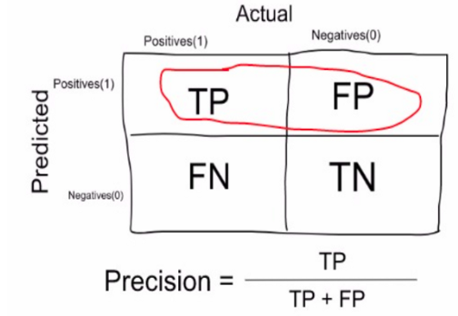
</div>

#### Sensitividade, Recall, hit rate TPR (True Positive Rate)

Taxa de itens positivos a uma classe, que fora classificados como positivo pelo modelo do total de itens positivos.

Recall = TP / (TP + FN)

<!--
The recall is alternatively called a true positive rate. It refers to the number of positives that have been claimed by your model compared to the number of positives that are available throughout the data.
-->

<div style="text-align: center;">
	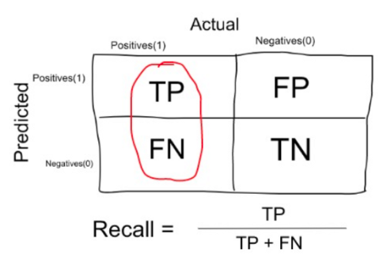
</div>

#### Especificidade, Seletividade Specifity, TNR (True Negative Rate)

Taxa de itens previstos como não pertencente a classe do total desses itens negativos a essa classe.

Especificidade = TN/ ( TN + FP)
<div style="text-align: center;">
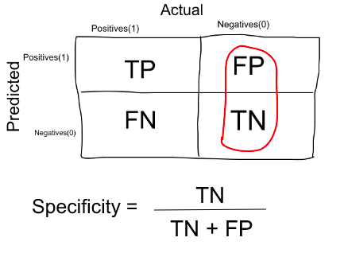
</div>

#### F1 Score

É a média harmônica entre precisão e recall. É uma medida melhor que o da acurácia quando as classe do dataSet estão desbalanceada pois ela vai refletir esse desbalanceamento.

F1 Score = 2 * Precisão * Recall / ( Precisão + Recall)

A média harmônica captura quando a quantidade de registros de uma classe é maior do que outra.

Exemplo:

<div style="text-align: center;">
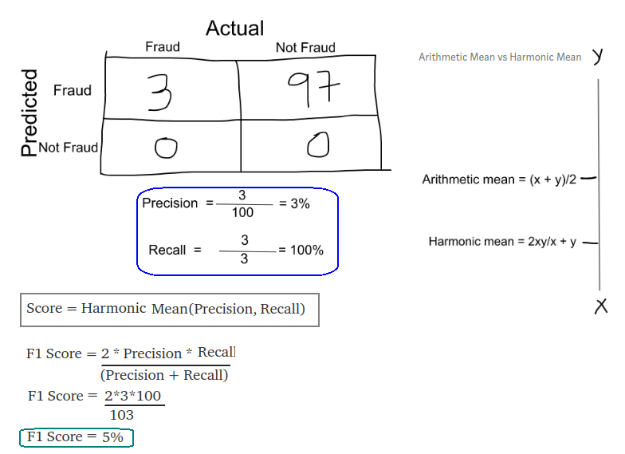
</div>

#### Matrix de confusão em scikit-learnig

Exemplo: Para um dataSet com dados de um possível cliente para comprar ou não um produto temos

````python
from sklearn.metrics import confusion_matrix, accuracy_score, classification_report
precisao = accuracy_score(y_test, y_pred)
matriz = confusion_matrix(y_test, y_pred)
print("Accuracy\n", precisao, "\n")
print("Matrix de Confusao\n",matriz, "\n")
print("Matrix de Confusao Porcentagem\n",matriz/matriz.sum(), "\n")
print(classification_report(y_test,y_pred, target_names=['Not Purchased', 'Purchased']))
````

Gerando

````python
Accuracy
 0.94 

Confusion Matrix
 [[65  3]
 [ 3 29]] 

Confusion Matrix Percentage
 [[0.65 0.03]
 [0.03 0.29]] 

               precision    recall  f1-score   support

Not Purchased       0.96      0.96      0.96        68
    Purchased       0.91      0.91      0.91        32

     accuracy                           0.94       100

Avaliando a classificacao para cada classe:
+ Precision: Numero total de positivos do total dos classificados como positivos para uma classe
+ Recall: Numero de Positivos que foram devidamente identificados para uma classe
+ F1-Score: Media Harmonica entre precisao e recall
+ Support: Quantidade de amostras de uma classe

Avaliacao geral
+ Acurracia
````

### Curva ROC e AUC ROC

A curva ROC representa uma relação entre sensibilidade (RECALL - ) e especificidade (NÃO PRECISÃO) e é comumente usada para medir o desempenho de classificadores binários.

**Interpretção**
+ E quando mais curvado e distante da diagonal , melhor é o desempenho do seu modelo.
+ Quanto mais próximo a curva do seu modelo da diagonal pior será o desempenho do modelo.
**Parâmetros**

+ TPR (true Positive Rate - Taxa de Verdadeiro Positivo) também chamado de **Sensibilidade** [0,1]

+ FPR (false Positve Rate - Taxa de Falso Positivo) que é calculado como `1 - ` **Especificidade** [0,1]


#### O que é ROC AUC, quando usar e como interpretar?

AUC (área debaixo da curva) ou AUC-ROC (Area Under the Receiver Operating Characteristics) é um valor numérico que resume a curva ROC.RC. Varia entre [0,1] quanto mais próximo de 1 melhor.

O interessante do AUC é que a métrica é invariante em escala, uma vez que trabalha com precisão das classificações ao invés de seus valores absolutos. Além disso, também mede a qualidade das previsões do modelo, independentemente do limiar de classificação.


AUC é o valor da integral da curva ROC. É um valor numérico entre \[0,1\].

É feito apartir do e TPR e FPR

Quanto maior o valor do AUC melhor será o modelo.


A seguir á alguns exemplos de gráficos ROC e valores AUC para entender a correlação entre eles

<div style="text-align: center;">

</div>
Exemplo de várias ROC

<div style="text-align: center;">
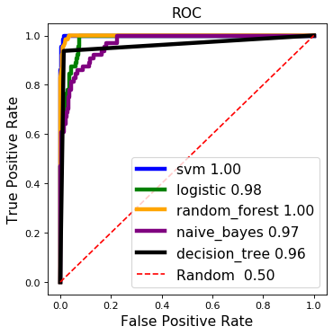
</div>


### Você pode explicar como a validação cruzada (`cross-validation`) funciona?

`cross-validation`: É executar um modelo de ML de várias formas diferentes (mudando a ordem de entrada das rows do dataset)

Ele verifica como determinados resultados de análises estatísticas específicas serão medidos quando colocados em um conjunto independente de dados.

A validação cruzada é o processo para separar seu dataset em dois subconjuntos: conjunto de treinamento e validação e avalia seu modelo para escolher os hiper parâmetros.

Esse dois subconjuntos são escolhidos aleartóriamente. Esse processo iterativamente, selecionando diferentes conjuntos de treinamento e validação, a fim de reduzir o viés que você teria selecionando apenas um conjunto específico para treinamento/validação.

Assim, para um mesmo modelo sai diversos modelos com hiper parâmetros diferentes, tendo assim scores diferentes.

A avaliação final do modelo é feita a apartir da média dos scores desse modelo.

### O que é K-fold cross-validation? 👶

A validação cruzada K-fold é um método de validação cruzada em que selecionamos um hiper parâmetro k. O conjunto de dados agora está dividido em k partes. Agora, tomamos a 1ª parte como conjunto de validação e o k-1 restante como conjunto de treinamento. Em seguida, tomamos a 2ª parte como conjunto de validação e as partes k-1 restantes como conjunto de treinamento. Assim, cada parte é usada como conjunto de validação uma vez e as partes restantes do k-1 são reunidas e usadas como conjunto de treinamento. Não deve ser usado em dados de séries temporais.

Mesmo que se divida a base em treino e teste para cada K. 

**QUAL A GARANTIA DE QUE CADA K TENHA A MESMA QUANTIDADE DE REGISTROS PARA CADA CLASSE**

**Exemplo infeliz:** Imagina que você divida a base em 50% para uma classificação binária. Se a os 50% que você pegar para treinamento só tiver 1 classe, então, ele não vai treinar corretamente para avaliar a outra classe.

Então, temos que garantir que no treinamento haja a mesma proporção de amostrar por classe


---
---
---

## Engenharia de Features

### DS-008 - Quais técnicas utilizadas para tratamento de variáveis categóricas?

Label Encoding
+ Usada quando há poucos valores únicos categóricos
+ Mapeia cada valor para um Número
+ Atenção: Use-o para quando o valor categórico poder ser convertido numa representação numérica:
  - Exemplo: Ruim, Bom, Ótimo [1,2,3]
  - Pois os valores numéricos terão impacto na aprendizagem, pois vai considerar o valor 1 mais fraco que 3 (no exemplo acima)

One Hot Encoding
+ Usada quando a variável categórica tem diversos valores
+ Para cada valor único, cria-se uma coluna a mais. É colocado 0 ou 1 para o caso de ter aquele atributo.
+ Exemplo Um atributo 'cidade' de um estado
  - Se existir X cidades, então são criadas mais X features, para cada row do dataSet, somente uma dessa X novas features terá o valor 1, as outras X-1 features terão valor 0.

### Why do we need one-hot encoding? ‍⭐️

If we simply encode categorical variables with a Label encoder, they become ordinal which can lead to undesirable consequences. In this case, linear models will treat category with id 4 as twice better than a category with id 2. One-hot encoding allows us to represent a categorical variable in a numerical vector space which ensures that vectors of each category have equal distances between each other. This approach is not suited for all situations, because by using it with categorical variables of high cardinality (e.g. customer id) we will encounter problems that come into play because of the curse of dimensionality.

### DS-001 - Como selecionar as features mais importantes de um DataSet?

+ Remove as features que estão correlacionadas

Answer: Following are the methods of variable selection you can use:

Remove the correlated variables prior to selecting important variables
Use linear regression and select variables based on p values
Use Forward Selection, Backward Selection, Stepwise Selection
Use Random Forest, Xgboost and plot variable importance chart
Use Lasso Regression
Measure information gain for the available set of features and select top n features accordingly.

### Q38. When does regularization becomes necessary in Machine Learning?

https://www.analyticsvidhya.com/blog/2016/09/40-interview-questions-asked-at-startups-in-machine-learning-data-science/

Answer: Regularization becomes necessary when the model begins to ovefit / underfit. This technique introduces a cost term for bringing in more features with the objective function. Hence, it tries to push the coefficients for many variables to zero and hence reduce cost term. This helps to reduce model complexity so that the model can become better at predicting (generalizing).


### DS-001 - O que fazer com dados corrompidos ou faltantes?

Podemos:
+ Retirar as rows (se forem poucas estiverem corrompidas)
+ Retirar as colunas (se muitas rows estiverem corrompidas)
+ Colocar a média ou algum valor que faça sentido.

Dissecar:
https://analyticsindiamag.com/5-ways-handle-missing-values-machine-learning-datasets/

---
---
---

## Gradient boosting

### What is gradient boosting trees? ‍⭐️

Gradient boosting is a machine learning technique for regression and classification problems, which produces a prediction model in the form of an ensemble of weak prediction models, typically decision trees.


### What’s the difference between random forest and gradient boosting? ‍⭐️

Random Forests builds each tree independently while Gradient Boosting builds one tree at a time.
Random Forests combine results at the end of the process (by averaging or “majority rules”) while Gradient Boosting combines results along the way.

### Q21. Both being tree based algorithm, how is random forest different from Gradient boosting algorithm (GBM)?

https://www.analyticsvidhya.com/blog/2016/09/40-interview-questions-asked-at-startups-in-machine-learning-data-science/

Answer: The fundamental difference is, random forest uses bagging technique to make predictions. GBM uses boosting techniques to make predictions.

In bagging technique, a data set is divided into n samples using randomized sampling. Then, using a single learning algorithm a model is build on all samples. Later, the resultant predictions are combined using voting or averaging. Bagging is done is parallel. In boosting, after the first round of predictions, the algorithm weighs misclassified predictions higher, such that they can be corrected in the succeeding round. This sequential process of giving higher weights to misclassified predictions continue until a stopping criterion is reached.

Random forest improves model accuracy by reducing variance (mainly). The trees grown are uncorrelated to maximize the decrease in variance. On the other hand, GBM improves accuracy my reducing both bias and variance in a model.

---
---
---

## Parameter tuning


### Which hyper-parameter tuning strategies (in general) do you know? ‍⭐️

There are several strategies for hyper-tuning but I would argue that the three most popular nowadays are the following:

Grid Search is an exhaustive approach such that for each hyper-parameter, the user needs to manually give a list of values for the algorithm to try. After these values are selected, grid search then evaluates the algorithm using each and every combination of hyper-parameters and returns the combination that gives the optimal result (i.e. lowest MAE). Because grid search evaluates the given algorithm using all combinations, it’s easy to see that this can be quite computationally expensive and can lead to sub-optimal results specifically since the user needs to specify specific values for these hyper-parameters, which is prone for error and requires domain knowledge.

Random Search is similar to grid search but differs in the sense that rather than specifying which values to try for each hyper-parameter, an upper and lower bound of values for each hyper-parameter is given instead. With uniform probability, random values within these bounds are then chosen and similarly, the best combination is returned to the user. Although this seems less intuitive, no domain knowledge is necessary and theoretically much more of the parameter space can be explored.

---
---
---

## Dimensionality reduction

### What is the curse of dimensionality? Why do we care about it? ‍⭐️

Data in only one dimension is relatively tightly packed. Adding a dimension stretches the points across that dimension, pushing them further apart. Additional dimensions spread the data even further making high dimensional data extremely sparse. We care about it, because it is difficult to use machine learning in sparse spaces.


### Do you know any dimensionality reduction techniques? ‍⭐️

Singular Value Decomposition (SVD)
Principal Component Analysis (PCA)
Linear Discriminant Analysis (LDA)
T-distributed Stochastic Neighbor Embedding (t-SNE)
Autoencoders
Fourier and Wavelet Transforms


### What’s singular value decomposition? How is it typically used for machine learning? ‍⭐️

Singular Value Decomposition (SVD) is a general matrix decomposition method that factors a matrix X into three matrices L (left singular values), Σ (diagonal matrix) and R^T (right singular values).
For machine learning, Principal Component Analysis (PCA) is typically used. It is a special type of SVD where the singular values correspond to the eigenvectors and the values of the diagonal matrix are the squares of the eigenvalues. We use these features as they are statistically descriptive.
Having calculated the eigenvectors and eigenvalues, we can use the Kaiser-Guttman criterion, a scree plot or the proportion of explained variance to determine the principal components (i.e. the final dimensionality) that are useful for dimensionality reduction.

## O que é PCA?

PCA Intuition
What is the true purpose of PCA?
The true purpose is mainly to decrease the complexity of the model. It is to simplify the model while keeping relevance and performance. Sometimes you can have datasets with hundreds of features so in that case you just want to extract much fewer independent variables that explain the most the variance.

What is the difference between PCA and Factor Analysis?
Principal component analysis involves extracting linear composites of observed variables. Factor analysis is based on a formal model predicting observed variables from theoretical latent factors. PCA is meant to maximize the total variance to look for distinguishable patterns, and Factor analysis looks to maximize the shared variance for latent constructs or variables.

Should I apply PCA if my dataset has categorical variables?
You could try PCA, but I would be really careful, because categorical values can have high variances by default and will usually be unstable to matrix inversion.

Apply PCA and do cross validation to see if it can generalize better than the actual data. If it does, then PCA is good for your model. (Your training matrix is numerically stable). However, I am certain that in most cases, PCA does not work well in datasets that only contain categorical data. Vanilla PCA is designed based on capturing the covariance in continuous variables. There are other data reduction methods you can try to compress the data like multiple correspondence analysis and categorical PCA etc.

What is the best extra resource on PCA?
Check out this video that has an amazing explanation of PCA and studies it in more depth.

---

Significa: "Análise de Componetnes principais"

=> Para problemas linearmente separáveis

=> Deve-se ser feito asobre dados numéricos

**Diferenciar Seleçâo de Extração de características**

• Seleção de características x Extração de características
+ Seleção: Indicar os atributos mais importantes
+ Extração: AO fazer uma análise, criar novos atributos. É como unir atributos.
  - Encontrar relacionamentos entre os atributos para combinar eles e reduzir a dimensionalidade

Lembre-se, o PCA nâo é escolher os melhore "n" atributos, e sim reduzir para "n" atributos

**Características do PCA**

• PCA: Identifica a correlação entre variáveis, e caso haja uma forte
correlação é possível reduzir a dimensionalidade.
  - Exemplo: Se vocÊ têm duas variáveis com forte correlação vocÊ pde então unilas e asism reduzir em 1 a quantidade de features.

**Funcionamento**

• Um dos principais algoritmos de aprendizagem de máquina não
supervisionada (não há certo/errado apriori)
• Das m variáveis independentes, PCA extrai p <= m novas variáveis
independentes que explica melhor a variação na base de dados, sem
considerar a variável dependente
• O usuário pode escolher o número de p

COMPONETSE PRICINCPAIS SÂO OS COMEPONETNE DE features concatenados.

**Se com PCA fiacr pior?**

Abaixou um pouco, mas, você deve avaliar o `trade_off` entre a precisao e a velocidade.

Exemplo, será que mesmo reduzindo 1\% poderia ser melhor usar o PCA pois teria menos dados para classificar e assim ter menos custo computacional?

````python

pca.explained_variance_ratio_ Revela o quanto os componentes definem os dados, a importância deles.

Inicialmente, deve-se colocar PCA(n_components = None) para descobrir a variance_ratio para cada feature. Depois disos, escolher um número menor que len(features) cuja soma seja alta.

Um exemplo, prático. Calcular o PCA para 30 feautures e descobrir que, 3 features tem a soma de variance_ratio de 0.80. Ou seja, somente 3 variáveis já seriam necessário para contextualizar sua base com 80% de veracidade.

componentes = pca.explained_variance_ratio_
componentes
executed in 17ms, finished 16:07:54 2020-01-07
array([0.151561  , 0.10109701, 0.08980379, 0.08076277, 0.07627678,
       0.07357646])
componentes.sum()
executed in 31ms, finished 16:42:58 2020-01-07
0.5730778058904467

````
## LDA

**Questions LDA - English ML-AZ**
LDA Intuition
Could you please explain in a more simpler way the difference between PCA and LDA?
A simple way of viewing the difference between PCA and LDA is that PCA treats the entire data set as a whole while LDA attempts to model the differences between classes within the data. Also, PCA extracts some components that explain the most the variance, while LDA extracts some components that maximize class separability.

Feature Selection or Feature Extraction?
You would rather choose feature selection if you want to keep all the interpretation of your problem, your dataset and your model results. But if you don’t care about the interpretation and only car about getting accurate predictions, then you can try both, separately or together, and compare the performance results. So yes feature selection and feature extraction can be applied simultaneously in a given problem.

Can we use LDA for Regression?
LDA is Linear Discriminant Analysis. It is a generalization of Fisher’s linear discriminant, a method used in statistics, pattern recognition and machine learning to find a linear combination of features that characterizes or separates two or more classes of objects or events. The resulting combination may be used as a linear classifier, or, more commonly, for dimensionality reduction before later classification. However, for regression, we have to use ANOVA, a variation of LDA. LDA is also closely related to principal component analysis (PCA) and factor analysis in that they both look for linear combinations of variables which best explain the data. LDA explicitly attempts to model the difference between the classes of data. PCA on the other hand does not take into account any difference in class, and factor analysis builds the feature combinations based on differences rather than similarities. Discriminant analysis is also different from factor analysis in that it is not an interdependence technique: a distinction between independent variables and dependent variables (also called criterion variables) must be made. LDA works when the measurements made on independent variables for each observation are continuous quantities. When dealing with categorical independent variables, the equivalent technique is discriminant correspondence analysis.

LDA in Python
Which independent variables are found after applying LDA?
The two independent variables that you see, indexed by 0 and 1, are new independent variables that are not among your 12 original independent variables. These are totally new independent variables that were extracted through LDA, and that’s why we call LDA Feature Extraction, as opposed to Feature Selection where you keep some of your original independent variables.

How to decide the LDA n_component parameter in order to find the most accurate result?
You can run:

LDA(n\_components = None)
and it should give you automatically the ideal n_components.

How can I get the two Linear Discriminants LD1 and LD2 in Python?
You can get them by running the following line of code:

lda.scalings_

---

**LDA (Linear Discriminant Analysis)**

Possui mesma função do PCA mas envolve a classe dos dados, ou seja, é um algortimo supervisionado.

=> Para problemas linearmente separáveis

• Além de encontrar os componentes principais, LDA também encontra os eixos que maximizam a separação entre múltiplas classes

• É um algoritmo supervisionado por causa da relação que tem com as classes

• Das m variáveis independentes, LDA extrai p <= m novas variáveis independentes que mais separam as classes da variável dependente


---
---
---

## Case Studies

### Q4. You are given a data set on cancer detection. You’ve build a classification model and achieved an accuracy of 96%. Why shouldn’t you be happy with your model performance? What can you do about it?

https://www.analyticsvidhya.com/blog/2016/09/40-interview-questions-asked-at-startups-in-machine-learning-data-science/

Answer: If you have worked on enough data sets, you should deduce that cancer detection results in imbalanced data. In an imbalanced data set, accuracy should not be used as a measure of performance because 96% (as given) might only be predicting majority class correctly, but our class of interest is minority class (4%) which is the people who actually got diagnosed with cancer. Hence, in order to evaluate model performance, we should use Sensitivity (True Positive Rate), Specificity (True Negative Rate), F measure to determine class wise performance of the classifier. If the minority class performance is found to to be poor, we can undertake the following steps:

We can use undersampling, oversampling or SMOTE to make the data balanced.
We can alter the prediction threshold value by doing probability caliberation and finding a optimal threshold using AUC-ROC curve.
We can assign weight to classes such that the minority classes gets larger weight.
We can also use anomaly detection.
Know more: Imbalanced Classification
