## Índex

## Links
+ [https://br.bitdegree.org/tutoriais/data-science/#Dicas_gerais_e_resumo](https://br.bitdegree.org/tutoriais/data-science/#Dicas_gerais_e_resumo)

## Brief SUmmary

+ Box Cox: Ajusta uma distribuiçâo enviesada para Normal

+  Skewness (//iskinés) (trad: Distorção): Valor númerico que caracterisa a distorçâo em uma distribuiçâo nromal para valorea acima (se skness alto postivo) ou abaixo (skness alto negativo) da média. Para a ditribuiçâo normal, é o valor que caracteriza a inclinaçâo da variavel alaeartoria mais a direita ou a esquerda da média

## Distribuição Normal

### Termos


### O que é Distribuiçâo Normal

A Normal Distribution is also called “Gaussian Distribution” or more commonly known as “Bell Curve” as the probability distribution function plot of a normal distribution looks very like 🔔 bell-shaped.
A Normal Distribution is a univariate probability distribution, which means it is a distribution for only one random variable. Note: Multivariate normal distributions do exist but in this article, we would be talking about only univariate normal distribution.

### Distribuiçâo Normal Padronizada

Yes, it is as simple as it sounds. It is the Standardization(“making data free from the limitation of any scale”) of a normal distribution with a mean value μ = 0 and Standard Deviation σ = 1. That means any normally distributed curve with mean 0 and standard deviation 1 is said to be as Standard Normal Distribution.

Standardization gives us standard units for consideration. For example, If X records experimental measurements in feet, and Y records the experimental measurements in inches, and X and Y measure the same experiment in the lab, then their standardizations will be the same and follow the same Probability distribution function.

The normal random variable of a standard normal distribution is called a Z score(also known as Standard Score). Every normal random variable X can be transformed into a z score via the following equation:

Z-score equation, z = (X — μ) / σ

Z-scores are expressed in terms of “standard deviations from their means”. Resultantly, these z-scores have a distribution with a mean of 0 and a standard deviation of 1. The standard score is simply the score(say X), minus the mean score, divided by the standard deviation.

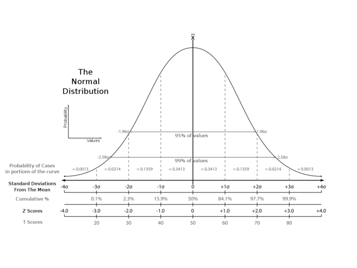

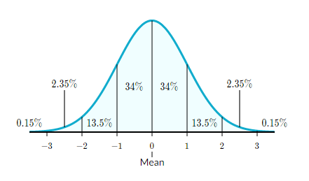

## valor sigma na curva de sino

The Power of 68–95–99.7 Rule for Bell Curve!

The rule of 68–95–99.7 talks about how the data is distributed across a Probability Distribution Function(PDF) of a Normal Distribution.

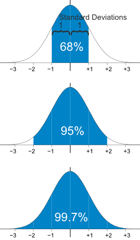


### Teorema Central do Limite

egundo o Teorema Central do Limite, para grandes amostras, independentemente da distribuição da variável de interesse, a distribuição das médias amostrais serão aproximadamente normalmente distribuídas, e tenderão a uma distribuição normal à medida que o tamanho de amostra crescer.

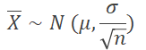

Sendo,
 μ = média das medidas individuais X 
σ = desvio padrão das medidas individuais X 
n = tamanho amostral

No exemplo abaixo, uma empresa mede a quantidade de defeitos em um lote de 100 produtos a cada duas horas. O histograma dos dados coletados a cada duas horas representa uma distribuição diferente da normal.  Em um segundo momento, os dados foram agrupados diariamente, ou seja, foi calculado a média de defeitos do dia de produção e utilizou-se o valor da média diária para gerar um novo histograma. Desta vez a distribuição já é normal.

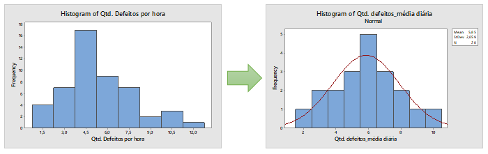

Leia mais em: https://www.voitto.com.br/blog/artigo/distribuicao-normal

### Curva da Normal - Gausiana

Conseguimos desenhar uma curva de distribuição normal tendo apenas dois parâmetros: média e desvio padrão. Considerando a probabilidade de ocorrência de um fenômeno, a área sob a curva representa 100%. Isso quer dizer que a probabilidade de uma observação assumir um valor entre dois pontos quaisquer é igual à área compreendida entre esses dois pontos.

Leia mais em: https://www.voitto.com.br/blog/artigo/distribuicao-normal


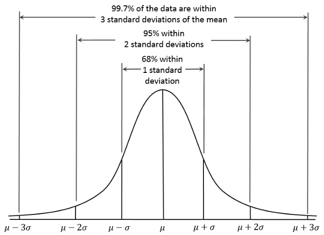


### Teste de Normalidade

### Por Gráficos 

#### Histograma

Histogram
When you get a sample of outcomes from an experiment, a common first step is to plot the number of occurrences against sample values to get the distribution curve (histogram). In many cases, the resulting curve will expose the type of probability distribution your data follows (or at least it will give you a good sense of it).
When working with Normal Distribution, you should look for a bell-shape curve. If you see a rough estimation of a bell, you can proceed with other tests to be fully sure that your samples come from a normal distribution.

#### Q-Q plot

Q-Q plot
This plot helps you determine if your dependent variable comes from a normal distribution. Q-Q plots take theoretical normal distribution quantiles (x-axis) and compare them against your sample data quantiles (y-axis). If both sets come from a normal distribution, then the scatter plot will roughly form a straight line with a 45 degree angle (see Fig 6 for an example). Keep in mind that, just like the histogram, the Q-Q plot is a visual check and it is subjective to what the reader might consider a good-enough straight line is.

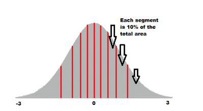

https://towardsdatascience.com/q-q-plots-explained-5aa8495426c0

InStatistics, Q-Q(quantile-quantile) plots play a very vital role to graphically analyze and compare two probability distributions by plotting their quantiles against each other. If the two distributions which we are comparing are exactly equal then the points on the Q-Q plot will perfectly lie on a straight line y = x.

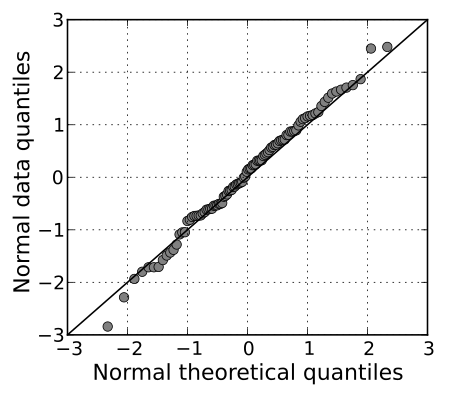


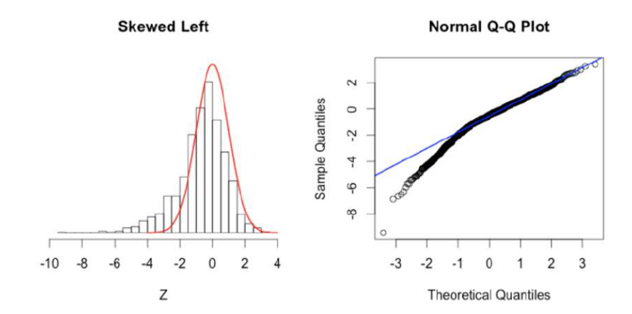

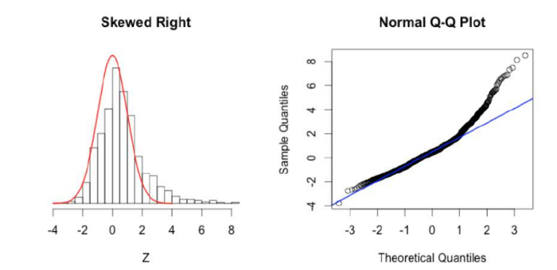

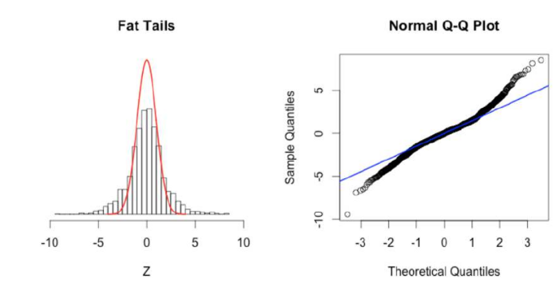

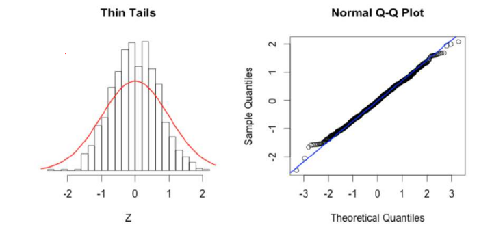


### Numérico

#### Testes Shapiro-Wiki 

A common statistical test for normality is the Shapiro-Wilk test, which tells you if your data comes from a normal distribution depending on the alpha level you have set.

### Anatomia da dist Nomrla

#### Skewness

https://help.gooddata.com/display/doc/Normality+Testing+-+Skewness+and+Kurtosis

Em estatística, a assimetria é uma medida da distorção da distribuição de probabilidade de uma variável aleatória sobre sua média. Em outras palavras, a assimetria informa a quantidade e a direção da inclinação (partida de simetria horizontal). O valor de assimetria pode ser positivo ou negativo ou ainda indefinido. Se a assimetria é 0, os dados são perfeitamente simétricos, embora seja bastante improvável para dados do mundo real. Via de regra:

+ Se a assimetria é menor que -1 ou maior que 1, a distribuição é altamente distorcida.
+ Se a assimetria é entre -1 e -0,5 ou entre 0,5 e 1, a distribuição é enviesada moderadamente.
+ Se a assimetria é entre -0,5 e 0,5, a distribuição é aproximadamente simétrica.


If skewness is less than −1 or greater than +1, the distribution is highly skewed.
If skewness is between −1 and −½ or between +½ and +1, the distribution is moderately skewed.
If skewness is between −½ and +½, the distribution is approximately symmetric.

Skeness positvo (asimetri a direita)

Mode > Median > Mean


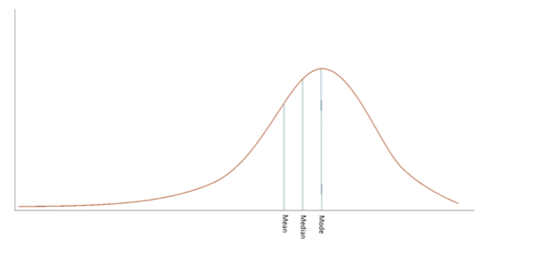

Skeness negativo (asimetri a esquerda)

Mode < Median < Mean


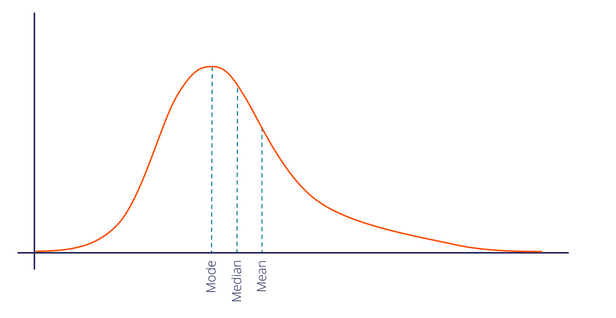


The Concept of Skewness
Skewness is also another measure to check for normality which tells us the amount and direction of the skewed data points. Generally for the value of Skewness:

+ If the value is less than -0.5, we consider the distribution to be negatively skewed or left-skewed where data points cluster on the right side and the tails are longer on the left side of the distribution
+ Whereas if the value is greater than 0.5, we consider the distribution to be positively skewed or right-skewed where data points cluster on the left side and the tails are longer on the right side of the distribution
+ And finally, if the value is between -0.5 and 0.5, we consider the distribution to be approximately symmetric


#### KURTOSIS

https://help.gooddata.com/display/doc/Normality+Testing+-+Skewness+and+Kurtosis

A curtose informa a altura e a nitidez do pico central, em relação a uma curva de sino padrão.

---

What is Kurtosis?
Another numerical measure to check for Normality is Kurtosis. Kurtosis gives the information regarding tailedness which basically indicates the data distribution along the tails.

For the symmetric type of distribution, the Kurtosis value will be close to Zero. We call such types of distributions as Mesokurtic distribution. Its tails are similar to Gaussian Distribution.


----------

Another numerical measure to check for Normality is Kurtosis. Kurtosis gives the information regarding tailedness which basically indicates the data distribution along the tails.

For the symmetric type of distribution, the Kurtosis value will be close to Zero. We call such types of distributions as Mesokurtic distribution. Its tails are similar to Gaussian Distribution.

Normal Distribution

If there are extreme values present in the data, then it means that more data points will lie along with the tails. In such cases, the value of K will be greater than zero. Here, Tail will be fatter and will have longer distribution. We call such types of distributions as Leptokurtic Distribution. As we can clearly see here, the tails are fatter and denser as compared to Gaussian Distribution:

Leptokurtic distribution.

If there is a low presence of extreme values compared to Normal Distribution, then lesser data points will lie along the tail. In such cases, the Kurtosis value will be less than zero. We call such types of distributions as Platykurtic Distribution. It will have a thinner tail and a shorter distribution in comparison to Normal distribution.

Platykurtic Distribution

----

https://analystprep.com/cfa-level-1-exam/quantitative-methods/kurtosis-and-skewness-types-of-distributions/

Leptokurtic
A leptokurtic distribution is more peaked than the normal distribution. The higher peak results from clustering of data points along the X-axis. The tails are also fatter than those of a normal distribution. The coefficient of kurtosis is usually found to be more than 3.

The term “lepto” means thin or skinny. When analyzing historical returns, a leptokurtic distribution means that small changes are less frequent since historical values are clustered around the mean. However, there are also large fluctuations represented by the fat tails.

Platykurtic
A platykurtic distribution has extremely dispersed points along the X-axis resulting to a lower peak when compared to the normal distribution. “Platy” means broad. Hence, the prefix fits the distribution’s shape, which is wide and flat. The points are less clustered around the mean, compared to the leptokurtic distribution. The coefficient of kurtosis is usually less than 3.

Returns that follow this type of distribution have less major fluctuations compared to leptokurtic returns. You should note that fluctuations represent the riskiness of an asset. More fluctuations represent more risk and vice versa. Therefore, platykurtic returns are less risky than leptokurtic returns.

Mesokurtic
Lastly, mesokurtic distributions have a curve that’s similar to that of the normal distribution. In other words, the distribution is largely normal.

### Box Cox - Ajustar a normal e tirar sua tendencia

https://brianmusisi.com/design/Predicting+House+Prices-2.html

We shall use Box-Cox transformation on the features with high "skewness". We shall use scipy's boxcox1p function, in essence computing a 1+x Box-Cox transformation. We'll use a value of lambda of 0.15.

````python
from scipy.special import boxcox1p

boxcox_features = skewness_df[np.abs(skewness_df['Skewness'])>0.75].index
lam = 0.15

for col in boxcox_features:
    entire.loc[:, col] = boxcox1p(entire[col], lam)
````

````python
from scipy.special import boxcox1p
from scipy.stats import boxcox_normmax # encontrar melhor
for i in skew_index:
	# nao sei porque mas todos colocam +1 no boxcox_normmax
    features[i] = boxcox1p(features[i], boxcox_normmax(features[i] + 1))

````

### Yeo-Johnson Transformation
 
Additionally, the power transformer yeo-johnson can be used. Python’s sci-kit learn provides the appropriate function:

````python
sklearn.preprocessing.PowerTransformer(method=’yeo-johnson’, standardize=True, copy=True)
````

### Como e quando  usar distribuiçâo Normal em DataScience

##### link 1

https://medium.com/data-hackers/normalizar-ou-padronizar-as-vari%C3%A1veis-3b619876ccc9

A transformação dos seus dados, que já estão tratados, é uma pratica para evitar que seu algoritmo fique enviesado para as variáveis com maior ordem de grandeza.

Padronizar (Normal): Tranformar numa distri normaml
+ padronizar as variáveis irá resultar em uma média igual a 0 e um desvio padrão igual a 1.
+ Padronizar os dados normalmente é feita usando a fórmula z-score:


Normalizar (Min-Max): Mudar range da distribuição

Já normalizar tem como objetivo colocar as variáveis dentro do intervalo de 0 e 1, caso tenha resultado negativo -1 e 1.


**ATENÇÃO**

Se a distribuição não é Gaussiana ou o desvio padrão é muito pequeno, normalizar Min-Max) os dados é uma escolha a ser tomada.

**Skewness**

Ok, suponhha que você tenha, por exmeplo o preço de casas e queira fazer regressâo. Obviamente, os preços sâo valores muito altos que vâo influenciar seu modelo, entâo, nos vamos padronizar.

O problema é que: **A PADRONIZAÇÂO DEVE SER FEITA EM VARIAVEIS ALERATORIAS QUE SIGAM A DISTRIBUIÇÂO NORMAL**. 

Nâo pense e padronizar tudo que vê pela frente.

OK, se for normal agora temos que ver o seu skness, ou seja, se há assimetraia. Pois, para cada caso, há um método melhor

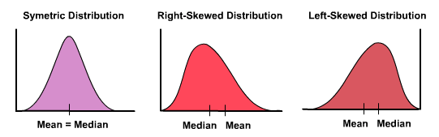

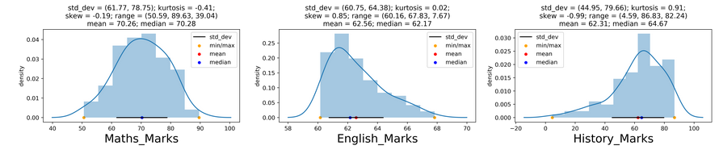

Assimetria positiva, pode ser tratada com as seguintes técnicas: raiz quadrada, raiz cúbica e log.

Assimetria negativa, pode ser tratada com as seguintes técnicas: quadrado, raiz cúbica e log. Entretanto, log tem um fator especial a ser considerado, você deverá criar uma condicional para os casos de valores negativos considerar a seguinte fórmula: -log(abs(-x)) e para os casos 0 deverá somar 1, exemplo: log(0+1), pois log(1) é zero.

### link 2

**An Example of How to Transform any Distribution to a Gaussian-like Distribution.**

It is possible to transform any distribution to a Gaussian-like distribution using an appropriate transform. The picture below shows a dataset with sample frequencies multiplied by power of 2, so the distribution becomes skewed to the left with a long tail on the right.

We can come up with an appropriate reverse-transform to make this dataset Gaussian. With the knowledge that sample frequencies were multiplied by a power of 2, we can use reverse-transform as logarithm of 2 to change the distribution. Picture below shows the distribution after applying log2(x) transformation.

### POrque algums dist nao sao normais

https://www.aquare.la/a-distribuicao-normal-em-data-analytics/#:~:text=Sua%20utiliza%C3%A7%C3%A3o%20da%20distribui%C3%A7%C3%A3o%20normal,dos%20M%C3%ADnimos%20Quadrados%2C%20por%20exemplo.

Outliers: Valores muito altos ou muito baixos podem distorcer a curva, a média é especialmente sensível aos extremos. Sugerimos remover os outliers e verificar como ficou a distribuição. Temos um artigo que aborda mais aprofundadamente o que são outliers e como tratá-los . 
Distribuições misturadas: Podem haver casos onde duas ou mais distribuições podem ser combinadas em seus dados. Se desenharmos um gráfico de distribuição com esses dois grupos, podem aparecer duas curvas misturadas, e quando são muitos grupos fica até difícil visualizar o que está acontecendo, e a análise pode demandar o uso de filtros complexos. 
Poucos dados: Dados insuficientes podem fazer com que uma distribuição normal pareça completamente deformada. Por exemplo, os resultados da idade dos pacientes de um hospital são distribuídos normalmente. Mas se você escolher três deles aleatoriamente, não obterá uma distribuição normal. Se você estiver em dúvida se possui um tamanho de amostra suficiente para ter resultados robustos, confira esse outro artigo no qual disponibilizamos uma calculadora de amostragem – O que é amostragem e como fazer o cálculo amostral?
Coleta incorreta dos dados: Se em um dataset (o que são datasets) existe uma coluna na qual é esperada uma curva normal, e esta fica deformada, verifique se não há filtros aplicados, ou se a coleta está sendo feita de forma adequada. 
Distribuição não normal: Por vezes, a distribuição pode simplesmente ser de outra natureza. A quantidade de vezes que a face de um dado se repete em jogadas seguidas, por exemplo, se comportaria de maneira uniforme. Ou seja, suas faces se repetiriam um número de vezes virtualmente igual. Classificaríamos sua distribuição, então, como uniforme.

---

This is a problem because most ML models don't do well with non-normally distributed data.


----

link: https://stats.stackexchange.com/questions/38237/can-anyone-tell-me-why-we-always-use-the-gaussian-distribution-in-machine-learni


---------

BOX COX

Box-Cox Transform

This is the last transformation method I want to explore today. As I don’t want to drill down into the math behind, here’s a short article for anyone interested in that part.
You should only know that it is just another way of handling skewed data. To use it, your data must be positive — so that can be a bummer sometimes.
You can import it from the Scipy library, but the check for the skew you’ll need to convert the resulting Numpy array to a Pandas Series:


apply this image

kurtoise-09.jpeg
